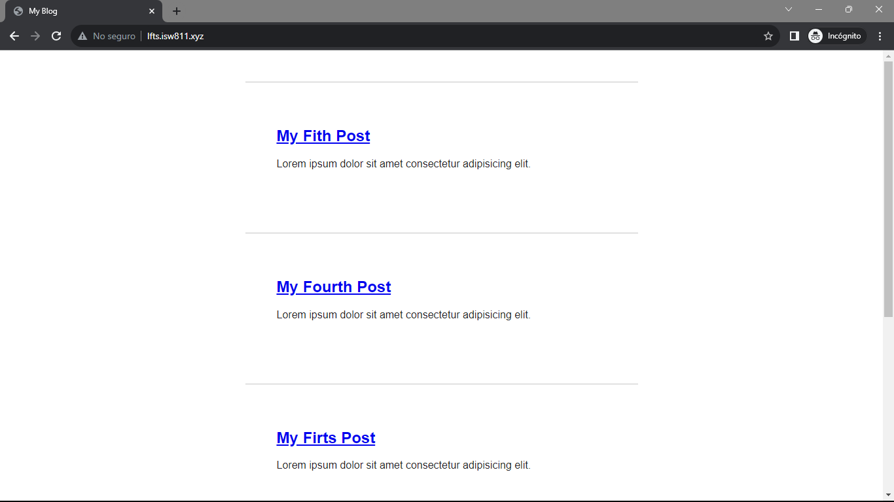
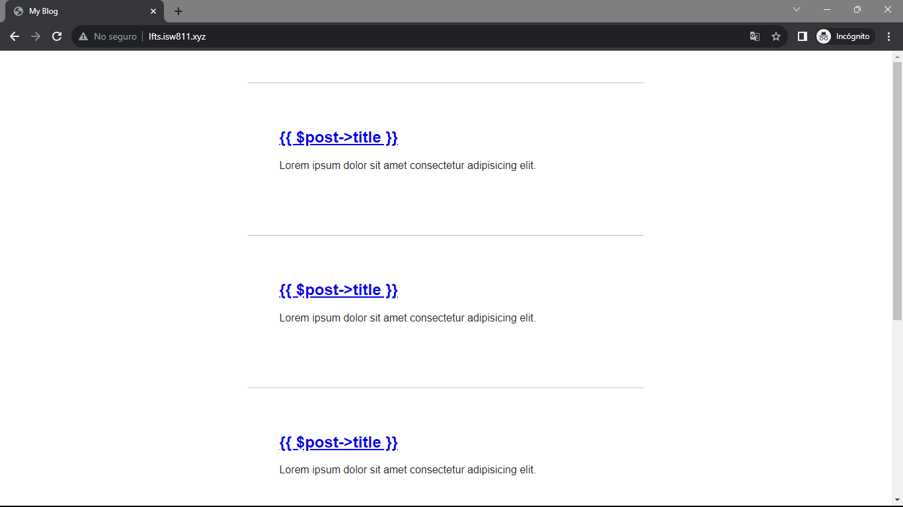

[< Volver a la pagina principal](/docs/readme.md)

# Blade: The Absolute Basics

Blade es el motor de plantillas de Laravel para tus vistas. Puede considerarlo como una capa encima de PHP para hacer que la sintaxis sea requerida para construir estas vistas, y estas sean lo más limpia y concisa posible. En última instancia, estas plantillas de Blade serán compiladas para vainilla PHP detrás de escena.

Un ejemplo es cambiar el archivo `post.blade.php` a `post.php`, y en el codigo hacer el siguiente cambio:

```html
 <body>
    <?php foreach ($posts as $post) : ?>
        <article>
            <h1>
                <a href="/posts/<?= $post->slug; ?>">
                    {{ $post->title }}
                </a>

            </h1>

            <div>
                <?= $post->excerpt; ?>
            </div>
        </article>
    <?php endforeach; ?>
</body>
```

Si el archivo esta con la extension `.blade` la pagina debería funcionar sin ningun problema:



En cambio, si el archivo no tiene la extensión `.blade` y esta simplemente así `post.php`, la pagina no va a mostrar los titulos de los post.



Seguidamente de esto, para continuar con la sintaxsis correctamente de blade, modificaremos el archivo `posts.blade.php` cambiando el `foreach`, el llamado de los atributos y agregamos un clase al article:

 ```html
 <body>
    @foreach ($posts as $post)
    <article class="{{ $loop->even ? 'foobar' : '' }}">
        <h1>
            <a href="/posts/{{ $post->slug }}">
                {{ $post->title }}
            </a>

        </h1>

        <div>
            {{ $post->excerpt }}
        </div>
    </article>
    @endforeach
</body>
```

Igualmente, el archivo `post.blade.php` lo modificamos:

 ```html
 <body>
    <article>
        <h1>{{ $post->title }}</h1>

        <div>
            {!! $post->body !!}
        </div>
    </article>

    <a href="/">Go back</a>
</body>
```

