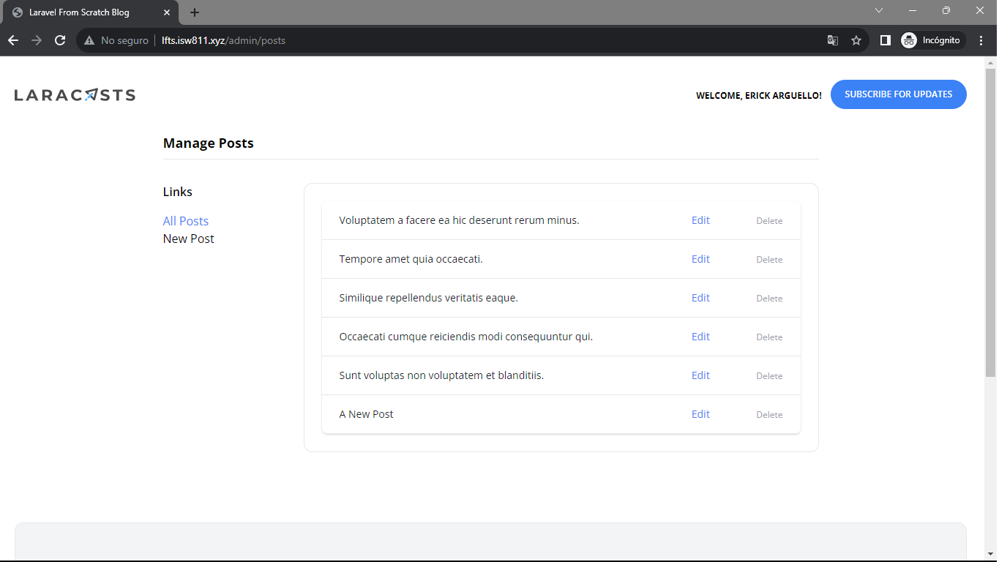
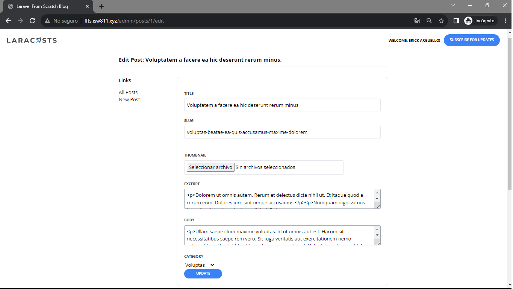
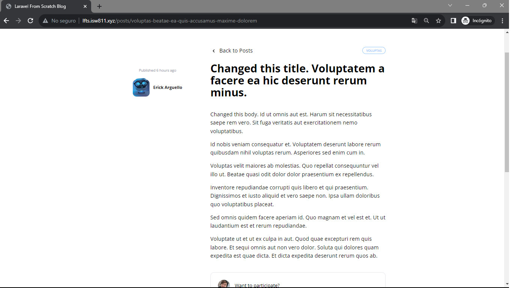

[< Volver a la pagina principal](/docs/readme.md)

# Create a Form to Edit and Delete Posts

Hay una característica evidente que falta y que debemos implementar: cualquier publicación puede ser editada o eliminada. Este episodio vamos a permitir eso.

Comenzamos en el archivo `web.php`, añadimos las siguiente rutas de admin.

```php
// Admin
Route::post('admin/posts', [AdminPostController::class, 'store'])->middleware('admin');
Route::get('admin/posts/create', [AdminPostController::class, 'create'])->middleware('admin');
Route::get('admin/posts', [AdminPostController::class, 'index'])->middleware('admin');
Route::get('admin/posts/{post}/edit', [AdminPostController::class, 'edit'])->middleware('admin');
Route::patch('admin/posts/{post}', [AdminPostController::class, 'update'])->middleware('admin');
Route::delete('admin/posts/{post}', [AdminPostController::class, 'destroy'])->middleware('admin');
```

Ahora nos movemos al archivo `PostController.php` y cortamos las funciones `create()` y `store()`, y esas funciones las pegamos en el siguiente archivo que vamos a crear.

Posteriormente, nos vamos a la maquina virtual y nos ubicamos en `/vagrant/sites/lfts.isw811.xyz$`, y ejecutamos el siguiente comando para crear un nuevo controller llamado `AdminPostController`.

```bash
php artisan make:controller AdminPostController
```

Ahora, nos ubicamos `AdminPostController.php` y agregamos el siguiente código.

```php
<?php

namespace App\Http\Controllers;

use App\Models\Post;
use Illuminate\Validation\Rule;

class AdminPostController extends Controller
{
    public function index()
    {
        return view('admin.posts.index', [
            'posts' => Post::paginate(50)
        ]);
    }

    public function create()
    {
        return view('admin.posts.create');
    }

    public function store()
    {
        $attributes = request()->validate([
            'title' => 'required',
            'thumbnail' => 'required|image',
            'slug' => ['required', Rule::unique('posts', 'slug')],
            'excerpt' => 'required',
            'body' => 'required',
            'category_id' => ['required', Rule::exists('categories', 'id')]
        ]);

        $attributes['user_id'] = auth()->id();
        $attributes['thumbnail'] = request()->file('thumbnail')->store('thumbnails');

        Post::create($attributes);

        return redirect('/');
    }

    public function edit(Post $post)
    {
        return view('admin.posts.edit', ['post' => $post]);
    }

    public function update(Post $post)
    {
        $attributes = request()->validate([
            'title' => 'required',
            'thumbnail' => 'image',
            'slug' => ['required', Rule::unique('posts', 'slug')->ignore($post->id)],
            'excerpt' => 'required',
            'body' => 'required',
            'category_id' => ['required', Rule::exists('categories', 'id')]
        ]);

        if (isset($attributes['thumbnail'])) {
            $attributes['thumbnail'] = request()->file('thumbnail')->store('thumbnails');
        }

        $post->update($attributes);

        return back()->with('success', 'Post Updated!');
    }

    public function destroy(Post $post)
    {
        $post->delete();

        return back()->with('success', 'Post Deleted!');
    }
}
```

Seguidamente, creamos una nueva carpeta llamada `admin` dentro de esta carpeta creamos otra carpeta llamada `posts` todo esto va creado dentro de la carpeta views.

Ahora si, movemos el archivo `create.blade.php` de la carpeta componentes a la carpeta `posts`. 

Y modificamos el código de la siguiente manera añadiéndole el `required` a todos los atributos.

```php
<x-layout>
    <x-setting heading="Publish New Post">
        <form method="POST" action="/admin/posts" enctype="multipart/form-data">
            @csrf

            <x-form.input name="title" required />
            <x-form.input name="slug" required />
            <x-form.input name="thumbnail" type="file" required />
            <x-form.textarea name="excerpt" required />
            <x-form.textarea name="body" required />

            <x-form.field>
                <x-form.label name="category" />

                <select name="category_id" id="category_id" required>
                    @foreach (\App\Models\Category::all() as $category)
                    <option value="{{ $category->id }}" {{ old('category_id') == $category->id ? 'selected' : '' }}>{{ ucwords($category->name) }}</option>
                    @endforeach
                </select>

                <x-form.error name="category" />
            </x-form.field>

            <x-form.button>Publish</x-form.button>
        </form>
    </x-setting>
</x-layout>
```

Nos movemos al archivo `layout.blade.php` y modificamos el componente `<x-dropdown-item` de la siguiente manera.

```php
<x-dropdown-item href="/admin/posts" :active="request()->is('admin/posts')">Dashboard</x-dropdown-item>
```

También, editamos el archivo `setting.blade.php` en donde al componente `<aside>` le agregamos un estilo mas en la clase y además al componente `<a href="/admin/dashboard"` lo editamos de la siguiente manera.

```php
<aside class="w-48 flex-shrink-0">
```

```php
<a href="/admin/posts" class="{{ request()->is('admin/posts') ? 'text-blue-500' : '' }}">All Posts</a>
```

Ahora, duplicamos el archivo `create.blade.php` dentro de la misma carpeta donde se encuentra y a ese archivo duplicado le cambiamos el nombre a `edit.blade.php` y modificamos el código de la siguiente manera.

```php
<x-layout>
    <x-setting :heading="'Edit Post: ' . $post->title">
        <form method="POST" action="/admin/posts/{{ $post->id }}" enctype="multipart/form-data">
            @csrf
            @method('PATCH')

            <x-form.input name="title" :value="old('title', $post->title)" required />
            <x-form.input name="slug" :value="old('slug', $post->slug)" required />

            <div class="flex mt-6">
                <div class="flex-1">
                    <x-form.input name="thumbnail" type="file" :value="old('thumbnail', $post->thumbnail)" />
                </div>

                thumbnail) }}" alt="" class="rounded-xl ml-6" width="100">
            </div>

            <x-form.textarea name="excerpt" required>{{ old('excerpt', $post->excerpt) }}</x-form.textarea>
            <x-form.textarea name="body" required>{{ old('body', $post->body) }}</x-form.textarea>

            <x-form.field>
                <x-form.label name="category"/>

                <select name="category_id" id="category_id" required>
                    @foreach (\App\Models\Category::all() as $category)
                        <option
                            value="{{ $category->id }}"
                            {{ old('category_id', $post->category_id) == $category->id ? 'selected' : '' }}
                        >{{ ucwords($category->name) }}</option>
                    @endforeach
                </select>

                <x-form.error name="category"/>
            </x-form.field>

            <x-form.button>Update</x-form.button>
        </form>
    </x-setting>
</x-layout>
```

Ahora editamos el archivo `input.blade.php` de la siguiente manera.

```php
@props(['name'])

<x-form.field>
    <x-form.label name="{{ $name }}"/>

    <input class="border border-gray-200 p-2 w-full rounded"
           name="{{ $name }}"
           id="{{ $name }}"
           {{ $attributes(['value' => old($name)]) }}
    >

    <x-form.error name="{{ $name }}"/>
</x-form.field>
```

Ahora editamos el archivo `textarea.blade.php` de la siguiente manera.

```php
@props(['name'])

<x-form.field>
    <x-form.label name="{{ $name }}" />

    <textarea
        class="border border-gray-400 p-2 w-full rounded"
        name="{{ $name }}"
        id="{{ $name }}"
        required
        {{ $attributes }}
    >{{ $slot ?? old($name) }}</textarea>

    <x-form.error name="{{ $name }}" />
</x-form.field>
```

Ahora, nos vamos al archivo `post-featured-card.blade.php` y eliminamos el componente `<a>` dentro del componente `<div class="space-x-2">`, y agregamos lo siguiente.

```php
<x-category-button :category="$post->category" />
```

Para finalizar, editamos los archivos `create.blade.php` de las carpetas `register` y `sessions`, agregando required a los atributos

* Archivo de la carpeta `register`.

```php
<x-layout>
    <section class="px-6 py-8">
        <main class="max-w-lg mx-auto mt-10">
            <x-panel>
                <h1 class="text-center font-bold text-xl">Register!</h1>

                <form method="POST" action="/register" class="mt-10">
                    @csrf

                    <x-form.input name="name" required />
                    <x-form.input name="username" required />
                    <x-form.input name="email" type="email" required />
                    <x-form.input name="password" type="password" autocomplete="new-password" required />
                    <x-form.button>Sign Up</x-form.button>
                </form>
            </x-panel>
        </main>
    </section>
</x-layout>
```

* Archivo de la carpeta `sessions`.

```php
<x-layout>
    <section class="px-6 py-8">
        <main class="max-w-lg mx-auto mt-10">
            <x-panel>
                <h1 class="text-center font-bold text-xl">Log In!</h1>
                <form method="POST" action="/login" class="mt-10">
                    @csrf

                    <x-form.input name="email" type="email" autocomplete="username" required />
                    <x-form.input name="password" type="password" autocomplete="current-password" required />

                    <x-form.button>Log In</x-form.button>
                </form>
            </x-panel>
        </main>
    </section>
</x-layout>
```

Y por ultimo, editamos el archivo `category-button.blade.php`.

```php
<x-layout>
    <section class="px-6 py-8">
        <main class="max-w-lg mx-auto mt-10">
            <x-panel>
                <h1 class="text-center font-bold text-xl">Log In!</h1>
                <form method="POST" action="/login" class="mt-10">
                    @csrf

                    <x-form.input name="email" type="email" autocomplete="username" required />
                    <x-form.input name="password" type="password" autocomplete="current-password" required />

                    <x-form.button>Log In</x-form.button>
                </form>
            </x-panel>
        </main>
    </section>
</x-layout>
```

Adjuntamos evidencia de la pagina funcionando.








