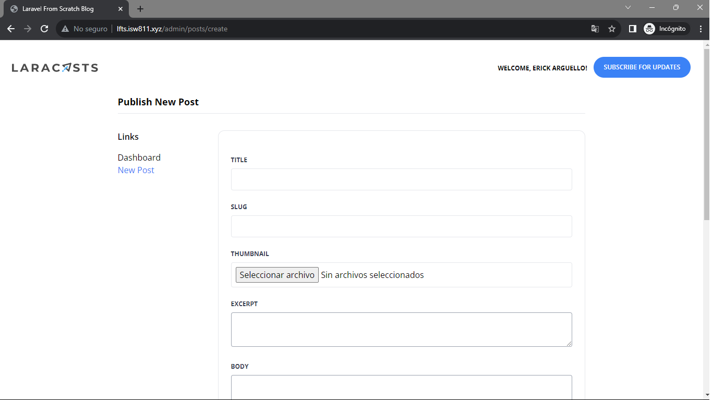

[< Volver a la pagina principal](/docs/readme.md)

# Extend the Admin Layout

En este episodio, agregaremos un menú desplegable de cuenta al área de navegación y luego ampliaremos el diseño de nuestra sección de configuración/administración de anuncios para permitir una barra lateral.

Iniciamos modificando el archivo `layout.blade.php`, donde cambiamos el componente `<span>` por lo siguiente.

```php
<x-dropdown>
    <x-slot name="trigger">
        <button class="text-xs font-bold uppercase">Welcome, {{ auth()->user()->name }}!</button>
    </x-slot>

    <x-dropdown-item href="/admin/dashboard">Dashboard</x-dropdown-item>
    <x-dropdown-item href="/admin/posts/create" :active="request()->is('admin/posts/create')">New Post</x-dropdown-item>
    <x-dropdown-item href="#" x-data="{}" @click.prevent="document.querySelector('#logout-form').submit()">Log Out</x-dropdown-item>

    <form id="logout-form" method="POST" action="/logout" class="hidden">
        @csrf
    </form>
</x-dropdown>
```

Seguidamente, modificamos los dos componentes `<a>` de register y log-in por lo siguiente.

```bash
<a href="/register" class="text-xs font-bold uppercase {{ request()->is('register') ? 'text-blue-500' : '' }}">Register</a>
<a href="/login" class="ml-6 text-xs font-bold uppercase {{ request()->is('login') ? 'text-blue-500' : '' }}">Log In</a>
```

Ahora, nos movemos al archivo `create.blade.php` y modificamos el código de la siguiente manera.

```php
<x-layout>
    <x-setting heading="Publish New Post">
        <form method="POST" action="/admin/posts" enctype="multipart/form-data">
            @csrf

            <x-form.input name="title" />
            <x-form.input name="slug" />
            <x-form.input name="thumbnail" type="file" />
            <x-form.textarea name="excerpt" />
            <x-form.textarea name="body" />

            <x-form.field>
                <x-form.label name="category" />

                <select name="category_id" id="category_id">
                    @foreach (\App\Models\Category::all() as $category)
                    <option value="{{ $category->id }}" {{ old('category_id') == $category->id ? 'selected' : '' }}>{{ ucwords($category->name) }}</option>
                    @endforeach
                </select>

                <x-form.error name="category" />
            </x-form.field>

            <x-form.button>Publish</x-form.button>
        </form>
    </x-setting>
</x-layout>
```

Después, creamos un nuevo archivo llamado `setting.blade.php` dentro de la carpeta `components` donde manejaremos los `link`, y añadimos el siguiente código.

```php
@props(['heading'])

<section class="py-8 max-w-4xl mx-auto">
    <h1 class="text-lg font-bold mb-8 pb-2 border-b">
        {{ $heading }}
    </h1>

    <div class="flex">
        <aside class="w-48">
            <h4 class="font-semibold mb-4">Links</h4>

            <ul>
                <li>
                    <a href="/admin/dashboard" class="{{ request()->is('admin/dashboard') ? 'text-blue-500' : '' }}">Dashboard</a>
                </li>

                <li>
                    <a href="/admin/posts/create" class="{{ request()->is('admin/posts/create') ? 'text-blue-500' : '' }}">New Post</a>
                </li>
            </ul>
        </aside>

        <main class="flex-1">
            <x-panel>
                {{ $slot }}
            </x-panel>
        </main>
    </div>
</section>
```

Seguidamente, nos vamos al archivo `input.blade.php` y lo modificamos de la siguiente manera.

```php
@props(['name'])

<x-form.field>
    <x-form.label name="{{ $name }}"/>

    <input class="border border-gray-200 p-2 w-full rounded"
           name="{{ $name }}"
           id="{{ $name }}"
           value="{{ old($name) }}"
           required
           {{ $attributes }}
    >

    <x-form.error name="{{ $name }}"/>
</x-form.field>
```

También, editamos el archivo `textarea.blade.php` a lo siguiente.

```php
@props(['name'])

<x-form.field>
    <x-form.label name="{{ $name }}" />

    <textarea
        class="border border-gray-400 p-2 w-full rounded"
        name="{{ $name }}"
        id="{{ $name }}"
        required
        {{ $attributes }}
    >{{ old($name) }}</textarea>

    <x-form.error name="{{ $name }}" />
</x-form.field>
```

Ahora, editamos el archivo `create.blade.php` de la carpeta `register`.

```php
<x-layout>
    <section class="px-6 py-8">
        <main class="max-w-lg mx-auto mt-10">
            <x-panel>
                <h1 class="text-center font-bold text-xl">Register!</h1>

                <form method="POST" action="/register" class="mt-10">
                    @csrf

                    <x-form.input name="name" />
                    <x-form.input name="username" />
                    <x-form.input name="email" type="email" />
                    <x-form.input name="password" type="password" autocomplete="new-password" />
                    <x-form.button>Sign Up</x-form.button>
                </form>
            </x-panel>
        </main>
    </section>
</x-layout>
```

Continuamos, con el archivo `create.blade.php` pero esta vez el de la carpeta `sessions` y lo editamos de la siguiente manera.

```php
<x-layout>
    <section class="px-6 py-8">
        <main class="max-w-lg mx-auto mt-10">
            <x-panel>
                <h1 class="text-center font-bold text-xl">Log In!</h1>
                <form method="POST" action="/login" class="mt-10">
                    @csrf

                    <x-form.input name="email" type="email" autocomplete="username" />
                    <x-form.input name="password" type="password" autocomplete="current-password" />

                    <x-form.button>Log In</x-form.button>
                </form>
            </x-panel>
        </main>
    </section>
</x-layout>
```

Para finalizar, nos vamos al archivo `dropdown.blade.php` y editamos el `<div x-data>` agregandole un class.

```php
<div x-data="{ show: false }" @click.away="show = false" class="relative">
```

Verificamos que todo este funcionando en la pagina.

