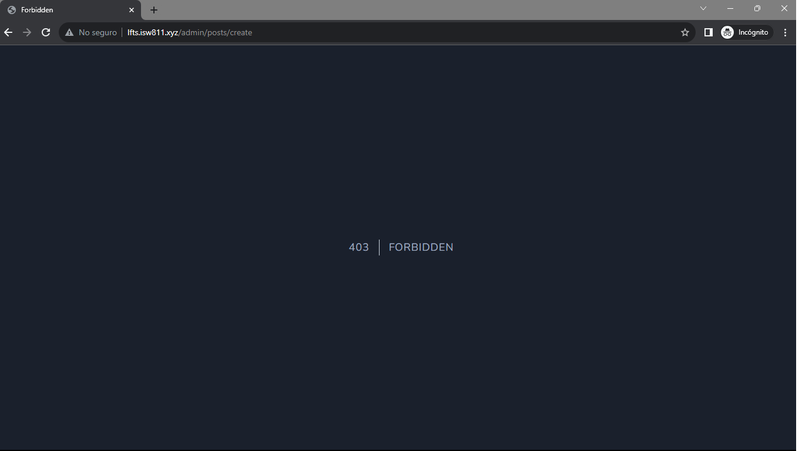

[< Volver a la pagina principal](/docs/readme.md)

# Limit Access to Only Admins
 
Finalmente trabajaremos en la sección de administración para publicar nuevos posts. Antes de comenzar a construir el formulario, primero averigüemos cómo agregar la capa de autorización necesaria para garantizar que solo los administradores puedan acceder a esta sección del sitio.

Iniciamos ubicándonos en el archivo `web.php` y agregamos las siguiente rutas de administrador.

```php
Route::get('admin/posts/create', [PostController::class, 'create'])->middleware('admin');
Route::post('admin/posts', [PostController::class, 'store'])->middleware('admin');
```

Seguidamente nos vamos al archivo `PostController.php` y agregamos las siguiente funciones.

```php
public function create()
    {
        return view('posts.create');
    }

    public function store()
    {
        $attributes = request()->validate([
            'title' => 'required',
            'slug' => ['required', Rule::unique('posts', 'slug')],
            'excerpt' => 'required',
            'body' => 'required',
            'category_id' => ['required', Rule::exists('categories', 'id')]
        ]);

        $attributes['user_id'] = auth()->id();

        Post::create($attributes);

        return redirect('/');
    }
```

Posteriormente, nos vamos a la maquina virtual y creamos un nuevo archivo middleware llamado `MustBeAdministrator.php` con el siguiente comando.

```bash
php artisan make:middleware MustBeAdministrator
```

Ahora nos vamos a ese nuevo archivo creado y agregamos el siguiente codigo.

```php
<?php

namespace App\Http\Middleware;

use Closure;
use Illuminate\Http\Request;
use Symfony\Component\HttpFoundation\Response;

class MustBeAdministrator
{
    /**
     * Handle an incoming request.
     *
     * @param \Illuminate\Http\Request $request
     * @param \Closure $next
     * @return mixed
     */
    public function handle(Request $request, Closure $next)
    {
        if (auth()->user()?->username !== 'JeffreyWay') {
            abort(Response::HTTP_FORBIDDEN);
        }

        return $next($request);
    }
}
```

Seguidamente nos vamos al archivo `Kernel.php` y agregamos la siguiente linea de código en el atributo `$routeMiddleware`, Ademas también llamamos al archivo anteriormente creado.

```php
'admin' => MustBeAdministrator::class,
```

```php
use App\Http\Middleware\MustBeAdministrator;
```

Ahora, creamos un nuevo archivo dentro de la carpeta `posts` llamado `create.blade.php` y agregamos el siguiente código.

```php
<x-layout>
    <section class="px-6 py-8">
        <x-panel class="max-w-sm mx-auto">
            <form method="POST" action="/admin/posts">
                @csrf

                <div class="mb-6">
                    <label class="block mb-2 uppercase font-bold text-xs text-gray-700"
                           for="title"
                    >
                        Title
                    </label>

                    <input class="border border-gray-400 p-2 w-full"
                           type="text"
                           name="title"
                           id="title"
                           value="{{ old('title') }}"
                           required
                    >

                    @error('title')
                        <p class="text-red-500 text-xs mt-2">{{ $message }}</p>
                    @enderror
                </div>

                <div class="mb-6">
                    <label class="block mb-2 uppercase font-bold text-xs text-gray-700"
                           for="slug"
                    >
                        Slug
                    </label>

                    <input class="border border-gray-400 p-2 w-full"
                           type="text"
                           name="slug"
                           id="slug"
                           value="{{ old('slug') }}"
                           required
                    >

                    @error('slug')
                        <p class="text-red-500 text-xs mt-2">{{ $message }}</p>
                    @enderror
                </div>


                <div class="mb-6">
                    <label class="block mb-2 uppercase font-bold text-xs text-gray-700"
                           for="excerpt"
                    >
                        Excerpt
                    </label>

                    <textarea class="border border-gray-400 p-2 w-full"
                           name="excerpt"
                           id="excerpt"
                           required
                    >{{ old('excerpt') }}</textarea>

                    @error('excerpt')
                        <p class="text-red-500 text-xs mt-2">{{ $message }}</p>
                    @enderror
                </div>

                <div class="mb-6">
                    <label class="block mb-2 uppercase font-bold text-xs text-gray-700"
                           for="body"
                    >
                        Body
                    </label>

                    <textarea class="border border-gray-400 p-2 w-full"
                           name="body"
                           id="body"
                           required
                    >{{ old('body') }}</textarea>

                    @error('body')
                        <p class="text-red-500 text-xs mt-2">{{ $message }}</p>
                    @enderror
                </div>

                <div class="mb-6">
                    <label class="block mb-2 uppercase font-bold text-xs text-gray-700"
                           for="category_id"
                    >
                        Category
                    </label>

                    <select name="category_id" id="category_id">
                        @foreach (\App\Models\Category::all() as $category)
                            <option
                                value="{{ $category->id }}"
                                {{ old('category_id') == $category->id ? 'selected' : '' }}
                            >{{ ucwords($category->name) }}</option>
                        @endforeach
                    </select>

                    @error('category')
                        <p class="text-red-500 text-xs mt-2">{{ $message }}</p>
                    @enderror
                </div>

                <x-submit-button>Publish</x-submit-button>
            </form>
        </x-panel>
    </section>
</x-layout>
```

Y para finalizar, nos vamos al archivo `RegisterController` y editamos `User::create` por lo siguiente.

```php
auth()->login(User::create($attributes));
```

Verificamos lo realizado.

* Creamos un nuevo usuario no administrador.


