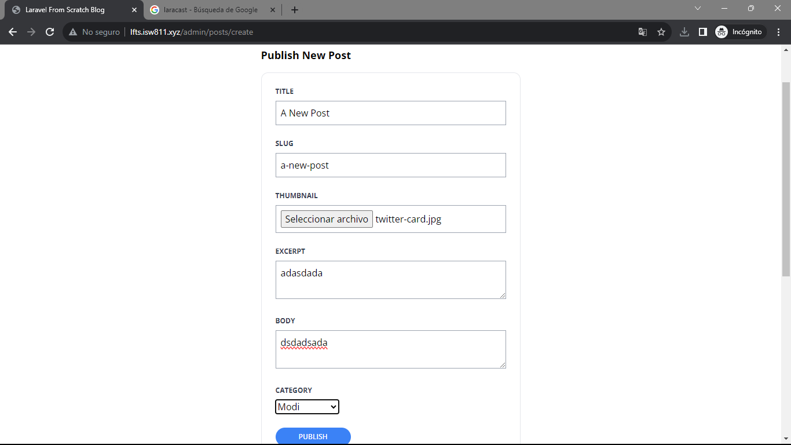
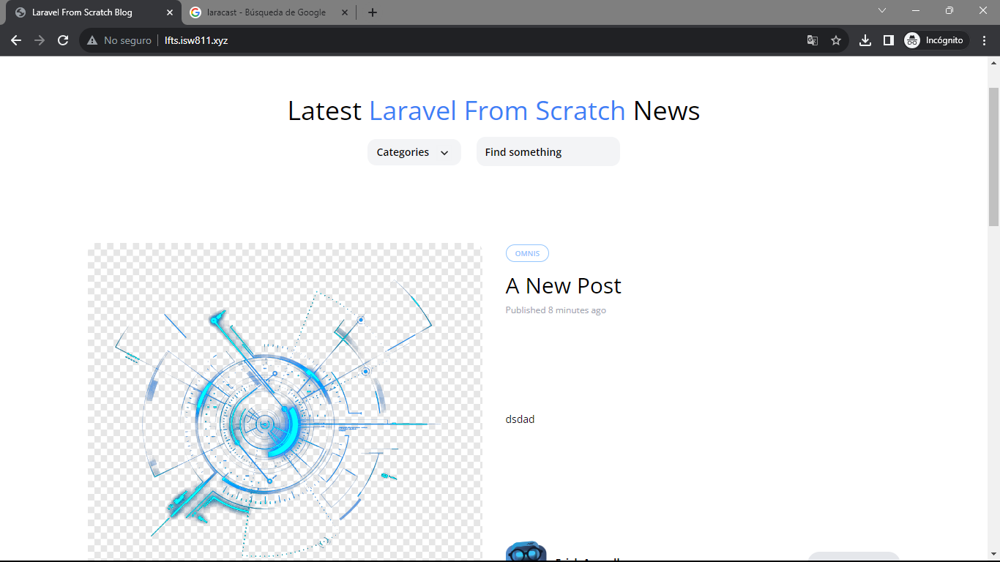

[< Volver a la pagina principal](/docs/readme.md)

# Validate and Store Post Thumbnails

En este episodio, vamos a cargar imágenes en el disco local mediante una entrada de archivo estándar y la clase UploadedFile de Laravel.

Iniciamos ubicándonos en el archivo `create.blade.php` y agregamos el siguiente `<div>` debajo del `<div>` de `slug`.

```php
<div class="mb-6">
    <label class="block mb-2 uppercase font-bold text-xs text-gray-700" for="thumbnail">
        Thumbnail
    </label>

    <input class="border border-gray-400 p-2 w-full" type="file" name="thumbnail" id="thumbnail" required>

    @error('thumbnail')
    <p class="text-red-500 text-xs mt-2">{{ $message }}</p>
    @enderror
</div>

```

Seguidamente nos vamos al archivo `PostController.php` y añadimos el siguiente atributo debajo del atributo `title`.

```php
'thumbnail' => 'required|image',
```

Además, en el mismo archivo añadimos tambien el siguiente atributo debajo del `$attributes['user_id']`.

```php
$attributes['thumbnail'] = request()->file('thumbnail')->store('thumbnails');
```

Seguidamente, nos vamos al archivo `filesystem.php` y modificamos la siguiente linea de codigo, de `local` lo pasamos a `public`.

```php
'default' => env('FILESYSTEM_DRIVER', 'public'),
```

Ahora, nos vamos al archivo `2023_10_18_110233_create_posts_table.php` y agregamos un nuevo atributo al `schema`.

```php
$table->string('thumbnail')->nullable();
```

Ahora, nos vamos a la maquina virtual y ejecutamos el siguiente comando para eliminar y volver a crear las tablas con los datos ya asignados y además con el nuevo atributo agregado.

```bash
php artisan migrate:fresh --seed
```

Ahora nos vamos al archivo `show.blade.php` y modificamos el atributo `` por el siguiente.

```php
thumbnail) }}" alt="" class="rounded-xl">
```

Y después, nos vamos a los archivos `post-card.blade` y `post-featured-card.blade.php`, y igualmente editamos el atributo ``.

```php
thumbnail) }}" alt="Blog Post illustration" class="rounded-xl">
```

Ahora para finalizar, nos vamos a la pagina web y verificamos lo realizado.



Post con la nueva imagen.


