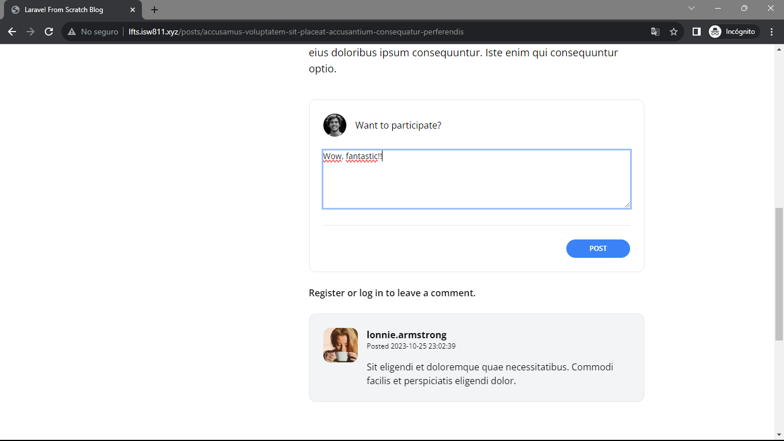
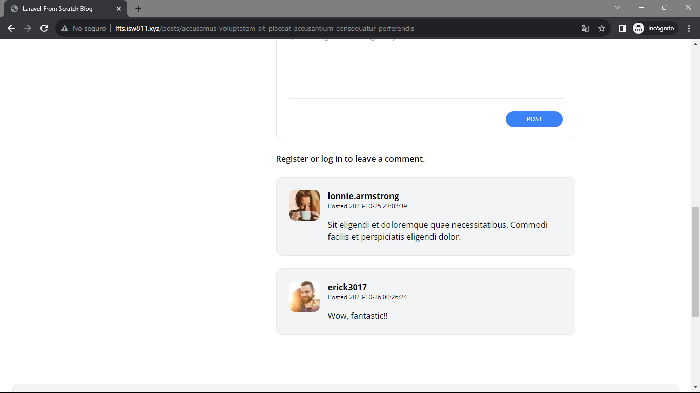

[< Volver a la pagina principal](/docs/readme.md)

# Activate the Comment Form

Ahora que el formulario de comentarios está completamente diseñado,

En este episodio, vamos agregar la lógica necesaria para activarlo.

Comenzamos creando un nuevo archivo controller dentro de la carpeta `Controller` llamado `PostCommentsController.php` y le agregamos el siguiente código.

```php
<?php

namespace App\Http\Controllers;

use App\Models\Post;
use Illuminate\Http\Request;

class PostCommentsController extends Controller
{
    public function store(Post $post)
    {
        request()->validate([
            'body' => 'required'
        ]);

        $post->comments()->create([
            'user_id' => request()->user()->id,
            'body' => request('body')
        ]);

        return back();
    }
}
```

Seguidamente, nos vamos al archivo `AppServiceProvider.php` y agregamos lo siguiente a la función `boot`.

```php
Model::unguard();
```

Ahora nos vamos al archivo `show.blade.php` y agregamos los componentes `@auth` antes del componte `<x-panel>` y  el `@endauth` después del componente `<p/>`.

Para finalizar verificamos lo realizado en la pagina.

* Agregando el comentario.



* Comentario agregado.


