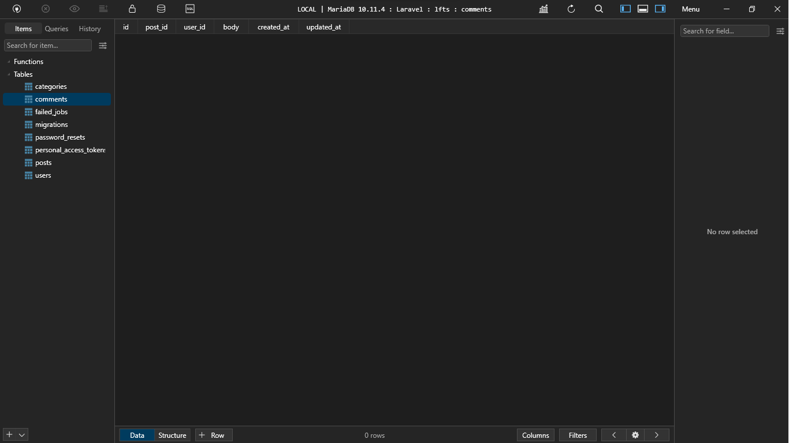

[< Volver a la pagina principal](/docs/readme.md)

# Table Consistency and Foreign Key Constraints

A continuación, en este episodio procedemos a crear la migración y la tabla correspondiente para nuestros comentarios. Esto nos dará la oportunidad de discutir más profundamente las restricciones de las claves externas.

Iniciamos abriendo nuestra maquina virtual ubicándonos en `/vagrant/sites/lfts.isw811.xyz` para ejecutar el siguiente comando para crear el model, la tabla de migración, el factory y el controller de los `comment` .

```bash
php artisan make:model Comment -mfc
```

Ahora, nos vamos al archivo nuevo creado llamado `2023_10_25_222810_create_comments_table.php` y agregamos los siguientes atributos al `Schema::create`

```php
Schema::create('comments', function (Blueprint $table) {
    $table->id();
    $table->foreignId('post_id')->constrained()->cascadeOnDelete();
    $table->foreignId('user_id')->constrained()->cascadeOnDelete();
    $table->text('body');
    $table->timestamps();
});
```

Seguidamente, nos vamos al archivo `2023_10_18_110233_create_posts_table.php` y editamos dentro del `Schema` el atributo `user_id`.

```php
$table->foreignId('user_id')->constrained()->cascadeOnDelete();
```

Ahora volvemos a nuestra maquina virtual y ejecutamos el siguiente comando para migrar la nueva tabla de comments creada a la base de datos.

```bash
php artisan migrate
```

Verificamos la base de datos con la nueva tabla:



