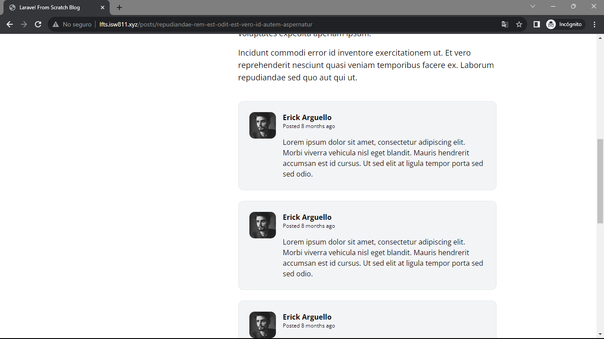

[< Volver a la pagina principal](/docs/readme.md)

# Write the Markup for a Post Comment

Pasemos ahora a publicar comentarios. En este episodio, comenzaremos con el marcado base para un comentario.

Damos inicio, creando un nuevo archivo llamado `post-comment.blade.php` dentro de la carpeta components, que se encuentra dentro de la carpeta views.

Una vez creado el archivo, agregamos el siguiente código para crear los comentarios en la pagina.

```html
<article class="flex bg-gray-100 border border-gray-200 p-6 rounded-xl space-x-4">
    <div class="flex-shrink-0">
        
    </div>

    <div>
        <header class="mb-4">
            <h3 class="font-bold">Erick Arguello</h3>

            <p class="text-xs">
                Posted
                <time>8 months ago</time>
            </p>
        </header>

        <p>
            Lorem ipsum dolor sit amet, consectetur adipiscing elit. Morbi viverra vehicula nisl
            eget blandit. Mauris hendrerit accumsan est id cursus. Ut sed elit at ligula tempor
            porta sed sed odio.
        </p>
    </div>
</article>
```

Seguidamente, nos vamos al archivo `show.blade.php` para hacer el llamado del archivo anteriormente creado. Este nuevo componente lo agregamos debajo del cierre del siguiente div: `<div class="col-span-8">`

```html
<section class="col-span-8 col-start-5 mt-10 space-y-6">
    <x-post-comment />
    <x-post-comment />
    <x-post-comment />
    <x-post-comment />
</section>
```

Para finalizar revisamos los comentario en la pagina web.

