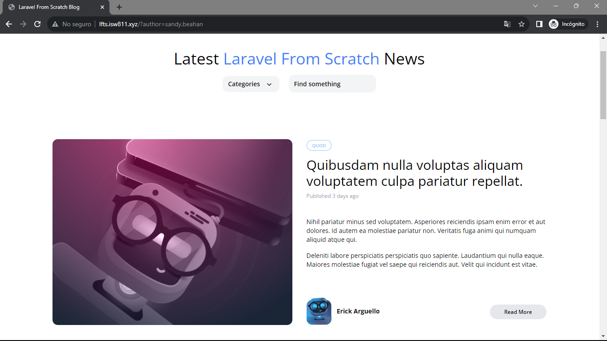

[< Volver a la pagina principal](/docs/readme.md)

# Author Filtering

En este episodio, vamos a añadir soporte para filtrar publicaciones de acuerdo a su autor respectivo. Con esta última pieza del rompecabezas, ahora podremos ordenar fácilmente todas las publicaciones por categoría, autor, texto de búsqueda o todo lo anterior.

Para comenzar, nos ubicamos en el archivo `post-card.blade.php`, y también en el archivo `post-featured-card.blade.php` y modificamos el siguiente `<div class="ml-3">`.

```php
<h5 class="font-bold">
    <a href="/authors/{{ $post->author->username }}">{{ $post->author->name}}</a>
</h5>
```

Seguidamente, nos vamos al archivo `web.php` y editamos el return de la ruta `Route::get('authors/{author:username}')`.

```php
return view('posts.index', [
        'posts' => $author->posts
    ]);
```

Posteriormente, nos vamos al archivo `Post.php` y agregamos lo siguiente a la función `scopeFilter`.

```php
$query->when($filters['author'] ?? false, fn ($query, $author) =>
            $query->whereHas('author', fn ($query) =>
                $query->where('username', $author)));
```

Ahora, nos vamos al archivo `show.blade.php` y editamos el siguiente `<div class="ml-3 text-left">` agregando el siguiente código.

```html
<h5 class="font-bold">
    <a href="/?author={{ $post->author->username }}">{{ $post->author->name}}</a>
</h5>
```

Seguidamente, volvemos a los archivos `post-card.blade.php`, y `post-featured-card.blade.php` y volvemos a editar el `<div class="ml-3">`.

```php
<h5 class="font-bold">
    <a href="/?author={{ $post->author->username }}">{{ $post->author->name}}</a>
</h5>
```

Y para finalizar, nos vamos al archivo `web.php` y eliminamos la ruta de `authors` para dejar más limpio el código.

Así se tendría que ver la pagina, con la ruta `author`.


