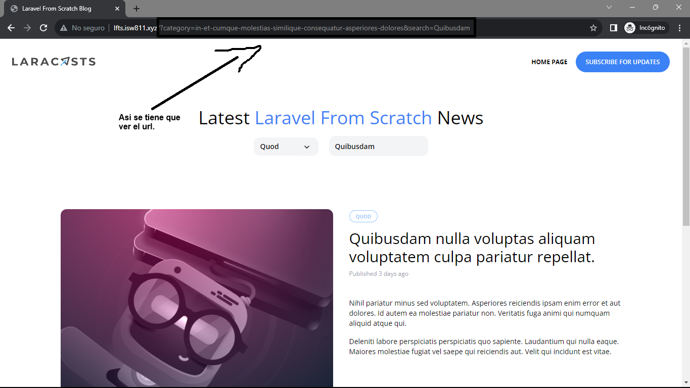

[< Volver a la pagina principal](/docs/readme.md)

# Merge Category and Search Queries

En este episodio, vamos actualizar tanto el menú desplegable de categoría como la entrada de búsqueda para incluir todos los parámetros de cadena de consulta existentes y relevantes.

Para empezar, nos vamos al archivo `_header.blade.php` y modificamos el `div` de `search`.

```php
<div class="relative flex lg:inline-flex items-center bg-gray-100 rounded-xl px-3 py-2">
            <form method="GET" action="/">
                
                @if (request('category'))
                <input type="hidden" name="category" value="{{ request('category') }}">
                @endif

                <input type="text" 
                name="search" 
                placeholder="Find something" 
                class="bg-transparent placeholder-black font-semibold text-sm" 
                value="{{ request('search') }}">
            </form>
        </div>
```

Y para finalizar, nos vamos al archivo `category-dropdown.blade.php` y modificamos el `href` del `x-dropdown-item` de categoría.

```php
href="/?category={{ $category->slug }}&{{ http_build_query(request()->except('category')) }}"
```

Verificamos si la pagina esta funcionando.



