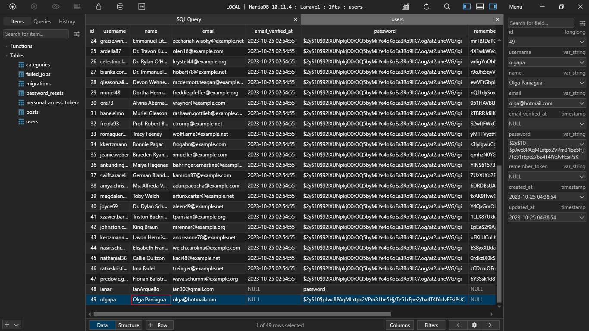

[< Volver a la pagina principal](/docs/readme.md)

# Automatic Password Hashing With Mutators

Terminamos el episodio anterior con un cliffhanger: Las contraseñas se estaban guardando en la base de datos en texto plano. Nunca podemos permitir esto. Por suerte, la solución es bastante fácil. Aprovecharemos a los mutadores elocuentes para asegurarnos de que las contraseñas siempre estén hashed antes de persistir.

En este episodio solo vamos a modificar un solo archivo.

El cual es `User.php`, vamos crear la siguiente función debajo del atributo `$casts`.

```php
public function setPasswordAttribute($password)
    {
        $this->attributes['password'] = bcrypt($password);
    }
```

Ahora vamos a la pagina web y creamos un usuario

Y lo verificamos en la base de datos.

