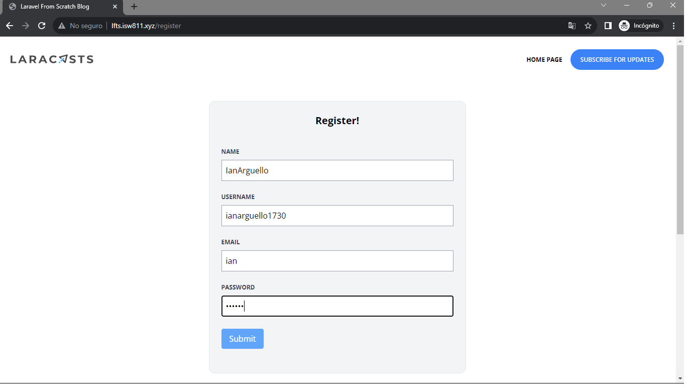
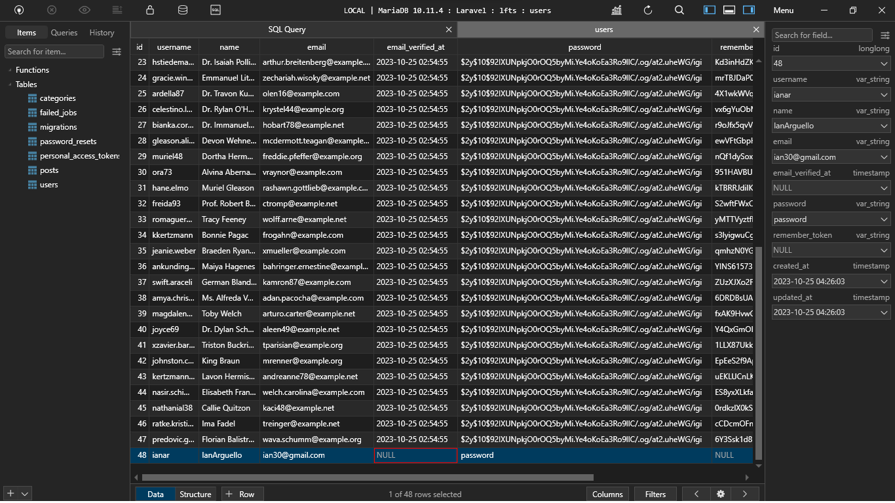

[< Volver a la pagina principal](/docs/readme.md)

# Build a Register User Page

En este episodio, empezamos con la gestión de formularios y la autenticación de usuarios. Para comenzar, vamos a crear una ruta que muestre un formulario de registro para registrarse en nuestro sitio.

Iniciamos abriendo el archivo `web.php` y creamos las siguiente las rutas:

```php
Route::get('register', [RegisterController::class, 'create'])->middleware('guest');
Route::post('register', [RegisterController::class, 'store'])->middleware('guest');
```

Ahora nos vamos a la maquina virtual para crear el archivo `RegisterController.php`.

Ya en la maquina, ejecutamos el siguiente comando.

```bash
php artisan make:controller RegisterController
```

Creado el archivo, nos ubicamos en ese archivo y realizamos las siguientes funciones.

```php
public function create()
    {
        return view('register.create');
    }

    public function store()
    {
        $attributes = request()->validate([
            'name' => 'required|max:255',
            'username' => 'required|min:3|max:255',
            'email' => 'required|email|max:255',
            'password' => 'required|min:7|max:255',
        ]);

        User::create($attributes);

        return redirect('/');
    }
```

Ahora, creamos una carpeta llamada `register` dentro de la carpeta `views`, seguidamente dentro de la carpeta register creamos un archivo llamado `create.blade.php` y agregamos lo siguiente.

```php
<x-layout>
    <section class="px-6 py-8">
        <main class="max-w-lg mx-auto mt-10 bg-gray-100 border border-gray-200 p-6 rounded-xl">
            <h1 class="text-center font-bold text-xl">Register!</h1>

            <form method="POST" action="/register" class="mt-10">
                @csrf

                <div class="mb-6">
                    <label class="block mb-2 uppercase font-bold text-xs text-gray-700" for="name">
                        Name
                    </label>

                    <input class="border border-gray-400 p-2 w-full" type="text" name="name" id="name" required>
                </div>

                <div class="mb-6">
                    <label class="block mb-2 uppercase font-bold text-xs text-gray-700" for="username">
                        Username
                    </label>

                    <input class="border border-gray-400 p-2 w-full" type="text" name="username" id="username" required>
                </div>

                <div class="mb-6">
                    <label class="block mb-2 uppercase font-bold text-xs text-gray-700" for="email">
                        Email
                    </label>

                    <input class="border border-gray-400 p-2 w-full" type="email" name="email" id="email" required>
                </div>

                <div class="mb-6">
                    <label class="block mb-2 uppercase font-bold text-xs text-gray-700" for="password">
                        Password
                    </label>

                    <input class="border border-gray-400 p-2 w-full" type="password" name="password" id="password" required>
                </div>

                <div class="mb-6">
                    <button type="submit" class="bg-blue-400 text-white rounded py-2 px-4 hover:bg-blue-500">
                        Submit
                    </button>
                </div>
            </form>
        </main>
    </section>
</x-layout>
```

Y para finalizar, nos vamos al archivo model `User.php` y eliminamos el atributo `$fillable`, y agregamos el siguiente atributo:

```php
protected $guarded = [];
```

Finalmente, procedemos a revisar el registro en la pagina.

* Primer proceso registrar el usuario.



* Segundo verificamos la creación del usuario en la base de datos.




