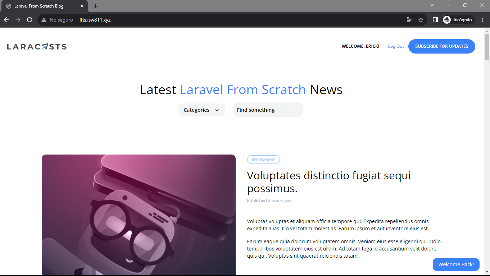

[< Volver a la pagina principal](/docs/readme.md)

# Build the Log In Page

Terminamos el episodio anterior creando un enlace de inicio de sesión, pero nos detuvimos justo antes de crear la vista. 

En este episodio abordaremos eso ahora.

Primero, nos vamos al archivo `web.php` y agregamos las siguientes rutas.

```php
Route::get('login', [SessionsController::class, 'create'])->middleware('guest');
Route::post('login', [SessionsController::class, 'store'])->middleware('guest');
```

Y después, creamos una nueva carpeta llamada `sessions` dentro de la carpeta `views` y creamos un nuevo archivo llamado `create.blade.php` y añadimos lo siguiente.

```php
<x-layout>
    <section class="px-6 py-8">
        <main class="max-w-lg mx-auto mt-10 bg-gray-100 border border-gray-200 p-6 rounded-xl">
            <h1 class="text-center font-bold text-xl">Log In!</h1>

            <form method="POST" action="/login" class="mt-10">
                @csrf

                <div class="mb-6">
                    <label class="block mb-2 uppercase font-bold text-xs text-gray-700"
                           for="email"
                    >
                        Email
                    </label>

                    <input class="border border-gray-400 p-2 w-full"
                           type="email"
                           name="email"
                           id="email"
                           value="{{ old('email') }}"
                           required
                    >

                    @error('email')
                        <p class="text-red-500 text-xs mt-2">{{ $message }}</p>
                    @enderror
                </div>

                <div class="mb-6">
                    <label class="block mb-2 uppercase font-bold text-xs text-gray-700"
                           for="password"
                    >
                        Password
                    </label>

                    <input class="border border-gray-400 p-2 w-full"
                           type="password"
                           name="password"
                           id="password"
                           required
                    >

                    @error('password')
                        <p class="text-red-500 text-xs mt-1">{{ $message }}</p>
                    @enderror
                </div>

                <div class="mb-6">
                    <button type="submit"
                            class="bg-blue-400 text-white rounded py-2 px-4 hover:bg-blue-500"
                    >
                        Log In
                    </button>
                </div>
            </form>
        </main>
    </section>
</x-layout>
```

Comprobamos en la pagina.

