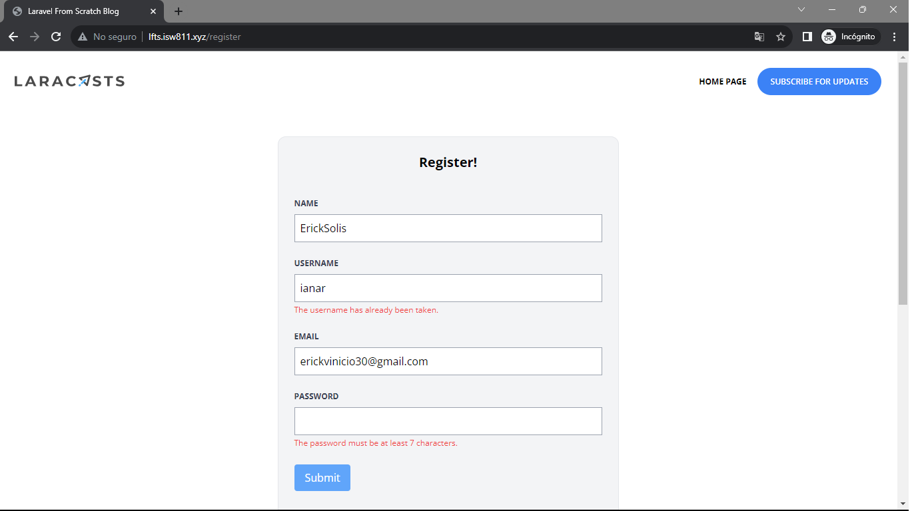

[< Volver a la pagina principal](/docs/readme.md)

# Failed Validation and Old Input Data

A continuación, tenemos que proporcionar al usuario retroalimentación cada vez que falla el comprobador de validación. 

En estos casos, podemos recurrir a la directiva -error Blade para mostrar fácilmente el mensaje de validación correspondiente de un atributo (si lo hay). También haremos cómo obtener datos de entrada old().

Primero nos vamos al archivo `create.blade.php`  y agregamos el atributo `value` dentro de todos los `inputs`.

```php
value="{{ old('name') }}"
```

Seguidamente, agregamos el siguiente `@error` debajo de todos los `input`.

```php
@error('name')
    <p class="text-red-500 text-xs mt-1">{{ $message }}</p>
@enderror
```

Y para finalizar, vamos al archivo `RegisterController.php` y modificamos los atributos `username` y `email`.

```php
'username' => 'required|min:3|max:255|unique:users,username',
'email' => 'required|email|max:255|unique:users,email',
```

Verificamos los errores en la pagina.

