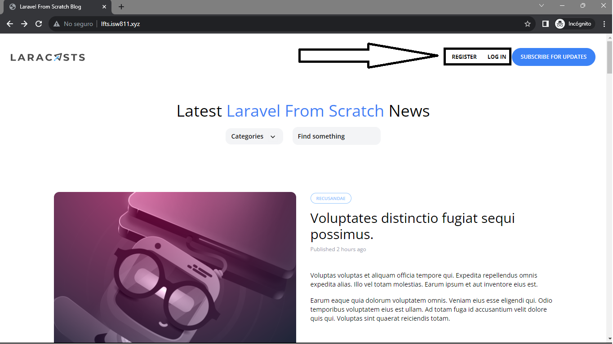

[< Volver a la pagina principal](/docs/readme.md)

# Login and Logout

La pieza final del rompecabezas es el inicio de sesión del usuario. Una vez más, podemos recurrir a la función auxiliar auth() (o facade) para realizar las acciones login() y logout().

Comenzamos abriendo el archivo `layout.blade.php` y modificamos el siguiente `div`.

```html
<div class="mt-8 md:mt-0 flex items-center">
                @auth
                    <span class="text-xs font-bold uppercase">Welcome, {{ auth()->user()->name }}!</span>

                    <form method="POST" action="/logout" class="text-xs font-semibold text-blue-500 ml-6">
                        @csrf

                        <button type="submit">Log Out</button>
                    </form>
                @else
                    <a href="/register" class="text-xs font-bold uppercase">Register</a>
                    <a href="/login" class="ml-6 text-xs font-bold uppercase">Log In</a>
                @endauth

                <a href="#" class="bg-blue-500 ml-3 rounded-full text-xs font-semibold text-white uppercase py-3 px-5">
                    Subscribe for Updates
                </a>
</div>
```

Seguidamente, nos vamos al archivo `RouteServiceProvider.php` y modificamos el atributo `HOME`.

```php
public const HOME = '/';
```

Ahora nos vamos al archivo `web.php` y creamos la siguiente ruta.

```php
Route::post('logout', [SessionsController::class, 'destroy'])->middleware('auth');
```

Posteriormente, abrimos nuestra maquina virtual y ejecutamos el siguiente comando para crear nuestro nuevo archivo llamado `SessionController.php`.

```bash
php artisan make:controller SessionController
```

Ahora, nos ubicamos en nuestro nuevo archivo creado y agregamos el siguiente código.

```php
<?php

namespace App\Http\Controllers;

use Illuminate\Validation\ValidationException;

class SessionsController extends Controller
{
    public function create()
    {
        return view('sessions.create');
    }

    public function store()
    {
        $attributes = request()->validate([
            'email' => 'required|email',
            'password' => 'required'
        ]);

        if (auth()->attempt($attributes)) {
            session()->regenerate();

            return redirect('/')->with('success', 'Welcome Back!');
        }

        throw ValidationException::withMessages([
            'email' => 'Your provided credentials could not be verified.'
        ]);
    }

    public function destroy()
    {
        auth()->logout();

        return redirect('/')->with('success', 'Goodbye!');
    }
}
```

Verificamos nuestra pagina.


