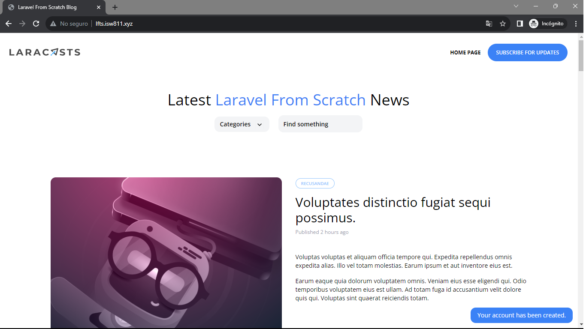

[< Volver a la pagina principal](/docs/readme.md)

# Show a Success Flash Message

Todavía no proporcionamos al usuario ningún comentario después de que se registre en nuestro sitio. Vamos a solucionarlo mostrando un mensaje flash de una sola vez.

Comenzamos, abriendo el archivo `layout.blade.php` y agregamos el siguiente componente debajo del componente `section`

```php
<x-flash />
```

Seguidamente, creamos un nuevo archivo llamado `flash.blade.php` en la carpeta components dentro de la carpeta views y agregamos lo siguiente.

``` php
@if (session()->has('success'))
    <div x-data="{ show: true }"
         x-init="setTimeout(() => show = false, 4000)"
         x-show="show"
         class="fixed bg-blue-500 text-white py-2 px-4 rounded-xl bottom-3 right-3 text-sm"
    >
        <p>{{ session('success') }}</p>
    </div>
@endif
```

Y para finalizar, nos vamos al archivo `RegisterController.php` y editamos el `return redirect`

```php
return redirect('/')->with('success', 'Your account has been created.');
```

Nos vamos a crear un nuevo usuario a la pagina y verificamos el mensaje.

