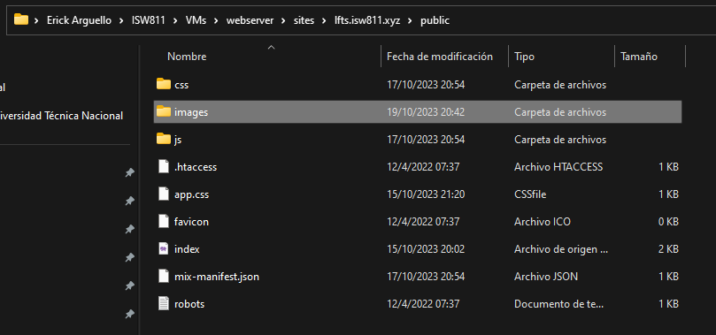

[< Volver a la pagina principal](/docs/readme.md)

# Convert the HTML and CSS to Blade

En este episodio, vamos a dar inicio con la construir del diseño real del blog para esta serie.

Para dar inicio, vamos a descargar el archivo zip del repositorio que se encuentra en el siguiente link:

* [Repositorio del Diseño de laracast](https://github.com/laracasts/Laravel-From-Scratch-HTML-CSS)

Posteriormente, vamos descomprimir y abrir la carpeta descargada, y vamos a copiar la carpeta de `images` y la vamos a pegar en nuestro proyecto específicamente en la carpeta `public`:



Seguidamente, abrimos el archivo `index.html` de la carpeta descargada y copiamos todo el código, y los pegamos en nuestro archivo `layout.blade.php`.

Refrescamos la pagina y se tendria que ver así:


Posteriormente, eliminaremos parte del código en el archivo `layout.blade.php`, eliminaremos desde el componente `<header>` hasta antes de el componente `<footer class="bg-gray-100 border border-black border-opacity-5 rounded-xl text-center py-16 px-10 mt-16">`.

Y asi se vería la pagina:


Ahora, el código eliminado anteriormente lo pegaremos en el archivo `posts.blade.php` y el codigo que se encontraba ahí lo documentamos.

Y en el archivo `layout.blade.php` escribimos lo siguiente entre el final del componente `</nav>` y el principio del componente `<footer>`

```htlm
{{ $slot }}
```

Después, eliminamos una parte del código, específicamente lo que se encuentra en el componente `<div class="lg:grid lg:grid-cols-3">` y solo el primer `<article>` se agrega en un nuevo archivo que vamos a crear en la carpeta `components` ubicada dentro de la carpeta `resources`.

```html
<article class="transition-colors duration-300 hover:bg-gray-100 border border-black border-opacity-0 hover:border-opacity-5 rounded-xl">
                <div class="py-6 px-5">
                    <div>
                        
                    </div>

                    <div class="mt-8 flex flex-col justify-between">
                        <header>
                            <div class="space-x-2">
                                <a href="#" class="px-3 py-1 border border-blue-300 rounded-full text-blue-300 text-xs uppercase font-semibold" style="font-size: 10px">Techniques</a>
                                <a href="#" class="px-3 py-1 border border-red-300 rounded-full text-red-300 text-xs uppercase font-semibold" style="font-size: 10px">Updates</a>
                            </div>

                            <div class="mt-4">
                                <h1 class="text-3xl">
                                    This is a big title and it will look great on two or even three lines. Wooohoo!
                                </h1>

                                <span class="mt-2 block text-gray-400 text-xs">
                                    Published <time>1 day ago</time>
                                </span>
                            </div>
                        </header>

                        <div class="text-sm mt-4">
                            <p>
                                Lorem ipsum dolor sit amet, consectetur adipiscing elit, sed do eiusmod tempor incididunt
                                ut labore et dolore magna aliqua. Ut enim ad minim veniam, quis nostrud exercitation
                                ullamco laboris nisi ut aliquip ex ea commodo consequat.
                            </p>

                            <p class="mt-4">
                                Duis aute irure dolor in reprehenderit in voluptate velit esse cillum dolore eu fugiat nulla pariatur.
                            </p>
                        </div>

                        <footer class="flex justify-between items-center mt-8">
                            <div class="flex items-center text-sm">
                                
                                <div class="ml-3">
                                    <h5 class="font-bold">Lary Laracore</h5>
                                    <h6>Mascot at Laracasts</h6>
                                </div>
                            </div>

                            <div>
                                <a href="#" class="transition-colors duration-300 text-xs font-semibold bg-gray-200 hover:bg-gray-300 rounded-full py-2 px-8">Read More</a>
                            </div>
                        </footer>
                    </div>
                </div>
            </article>
```

Y ahora, en el archivo `post.blade.php` dentro del `<div class="lg:grid lg:grid-cols-3">` agregamos lo siguiente:

```html
<x-post-card/>
<x-post-card/>
<x-post-card/>
```

También, eliminamos los `articles` dentro del `<div class="lg:grid lg:grid-cols-2">` y agregamos lo mismo:

```html
<x-post-card/>
<x-post-card/>
<x-post-card/>
```

Ahora, eliminamos los `articles` restantes del archivo `posts.blade.php` y los pegamos en un nuevo archivo que vamos a crear en la carpeta `componente` el cual se llamará `post-featured-card.blade.php` 

Después, volvemos al archivo `post.blade.php` y dentro del `main`, escribimos la siguiente linea de código:

```html
<main class="max-w-6xl mx-auto mt-6 lg:mt-20 space-y-6">
        <x-post-featured-card />
```

Por ultimo, eliminamos el componente `header` del archivo `post.blade.php` y seguidamente creamos un archivo nuevo dentro de la carpeta `views` que se llamará `_post-header.blade.php` y le pegamos el `header`.

Ahora volvemos al archivo `post.blade.php` y escribimos la siguiente linea código:

```html
@include ('_post-header')
```

