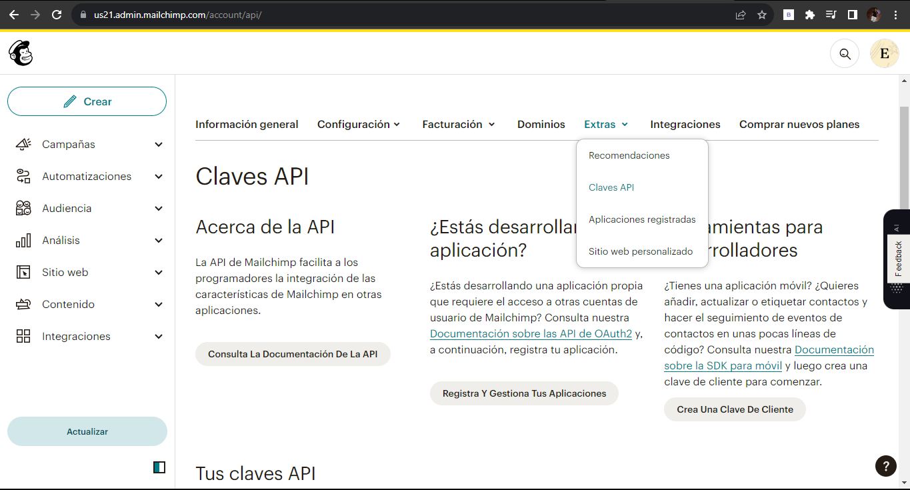
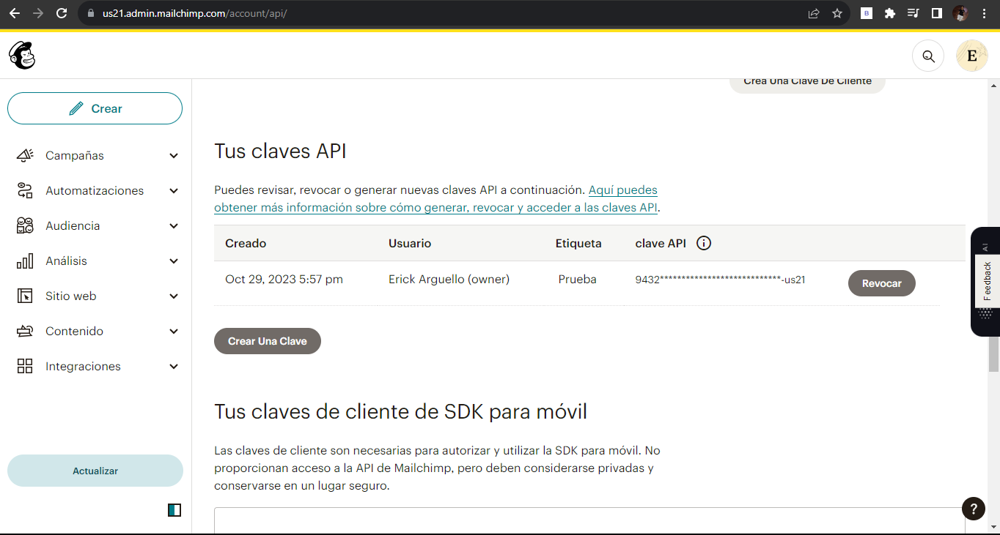

[< Volver a la pagina principal](/docs/readme.md)

# Mailchimp API Tinkering

Empecemos por familiarizarnos con la API de Mailchimp. 

En este episodio, aprenderemos a instalar el SDK oficial de PHP y luego revisaremos los conceptos básicos de cómo realizar algunas llamadas iniciales a la API.

Comenzamos ubicándonos en el archivo layout.blade.php para realizar varias modificaciones, 

* Primero, editamos el `href` del componente `<a>` del `"Suscribe for updates"`.

```html
<a href="#newsletter" class="bg-blue-500 ml-3 rounded-full text-xs font-semibold text-white uppercase py-3 px-5">
    Subscribe for Updates
</a>
```

* Luego, le añadimos un `id` al footer.

```html
<footer id="newsletter" class="bg-gray-100 border border-black border-opacity-5 rounded-xl text-center py-16 px-10 mt-16">
```

Seguidamente, nos vamos a la pagina [`https://us21.admin.mailchimp.com/`](https://us21.admin.mailchimp.com/) y nos registramos creando un cuenta.

Posteriormente creada la cuenta, nos vamos al apartado de perfil y luego al apartado de extras y seleccionamos `Claves api`



Seguidamente, creamos un clave api.



Ahora nos vamos al archivo `.env` y agregamos lo siguiente al final del documento.

```bash
MAILCHIMP_KEY=94322ffa8052645e36348a2df4e2fde2-us21
```

Después, nos vamos al archivo `services.php` y agregamos lo siguiente.

```php
'mailchimp' => [
        'key' => env('MAILCHIMP_KEY'),
        'lists' => [
            'subscribers' => env('MAILCHIMP_LIST_SUBSCRIBERS')
        ]
    ]
```

Ahora, abrimos nuestra maquina virtual y nos posicionamos en `/vagrant/sites/lfts.isw811.xyz` y ejecutamos el siguiente comando para instalar la librería del cliente para nuestro lenguaje.

```php
composer require mailchimp/marketing
```

Y para finalizar, nos vamos al archivo `web.php` y agregamos la siguiente ruta.

```php
Route::get('ping', function () {
    $mailchimp = new \MailchimpMarketing\ApiClient();

    $mailchimp->setConfig([
        'apiKey' => config('services.mailchmp.key'),
        'server' => 'us21'
    ]);

    $response = $mailchimp->lists->addListMember('list_id', [
        'email_address' => 'erickvinicio30@gmail.com',
        'status' => 'subscribed'
    ]);
    print_r($response);
});
```