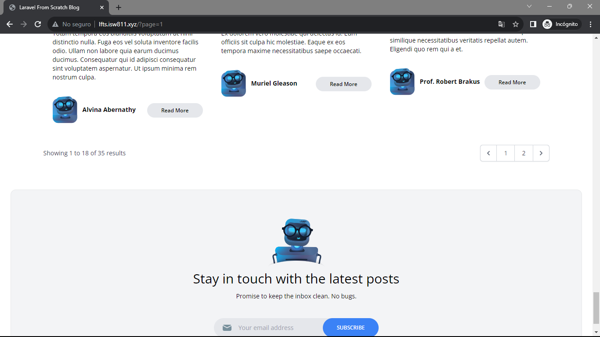

[< Volver a la pagina principal](/docs/readme.md)

# Laughably Simple Pagination

Actualmente estamos obteniendo todas las publicaciones de la base de datos y renderizándolas como una cuadrícula en la página de inicio. Pero, ¿qué sucede cuando tienes, quinientas entradas de blog? Eso es demasiado costoso de renderizar. La solución es aprovechar la paginación y por suerte, Laravel hace todo el trabajo.

En este episodio, solucionaremos ese problema.

Para empezar, nos vamos al `PostsController.php` y editamos la función `index`.

```php
return view('posts.index', [
            'posts' => Post::latest()->filter(
                request(['search', 'category', 'author'])
            )->paginate(18)->withQueryString()
        ]);
```

Seguidamente, nos vamos al archivo `index.blade.php` y agregamos lo siguiente debajo del componente `x-posts-grid`.

```php
{{ $posts->links() }}
```


Ahora nos vamos al archivo `category-dropdown.blade.php` y haremos lo siguiente

* Primero modificamos el `href` del componente `x-dropdown-item` que se encuentra dentro del `@foreach` agregando `page` en el `except`.

```php
href="/?category={{ $category->slug }}&{{ http_build_query(request()->except('category', 'page')) }}" 
```
* Después, modificamos el `href` del `x-dropdown-item` fuera del `@foreach`.

```php
href="/?{{ http_build_query(request()->except('category', 'page')) }}"
```

Ahora, abrimos nuestra maquina virtual y nos ubicamos en `/vagrant/sites/lfts.isw811.xyz`, y ejecutamos el siguiente comando.

```bash
php artisan vendor:publish
```

Para finaliza, verificamos nuestra pagina web.

