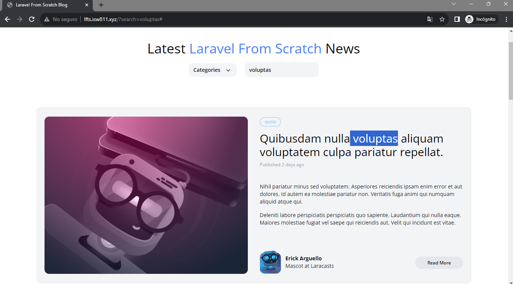

[< Volver a la pagina principal](/docs/readme.md)

# Search (The Messy Way)

En esta nueva sección, se implementara la funcionalidad de búsqueda de nuestro blog. vamos a demostrar esto en dos pasos. 

Primero, en este episodio, simplemente lo haremos funcionar. El código no será reutilizable o bonito. 

Pero luego, en el siguiente episodio, vamos a refactorizar un poco.

Primeramente, nos vamos al archivo `web.php` y agregamos y modificamos lo siguiente en la ruta `/` para poder hacer las búsquedas en la pagina.

```php
Route::get('/', function () {

    $posts = Post::latest();

    if(request('search')){
        $posts
            ->where('title', 'like', '%' . request('search') . '%')
            ->orWhere('body', 'like', '%' . request('search') . '%');
    }
    return view('posts', [
        'posts' => $posts->get(),
        'categories' => Category::all()
    ]);
```

Y seguidamente, nos vamos al archivo `_post-header.blade.php` y agregamos lo siguiente en el input de `search` para que los que buscamos no se borre de la barra de búsqueda.

```bash
value="{{ request('search') }}"
```

Y para finalizar verificamos la pagina web con los cambios realizados.



