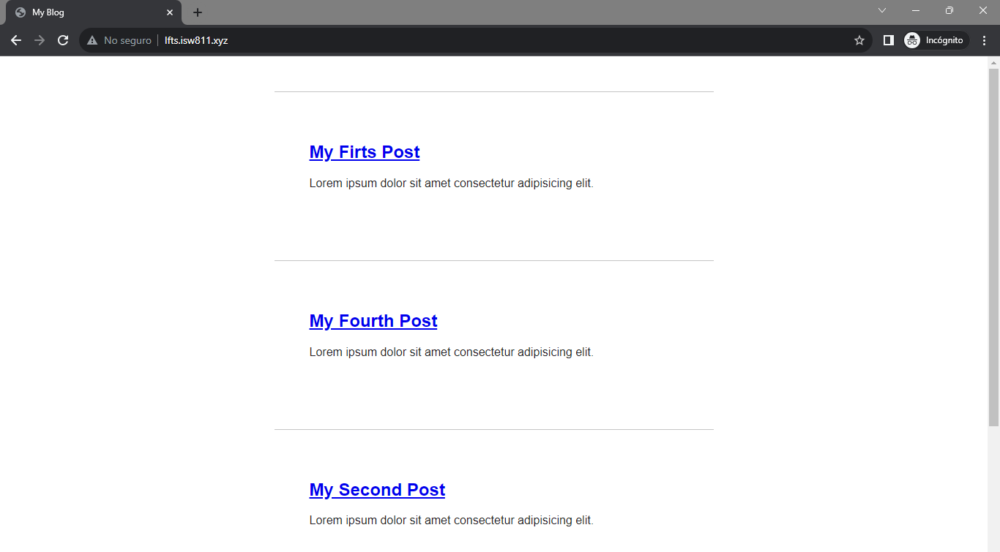
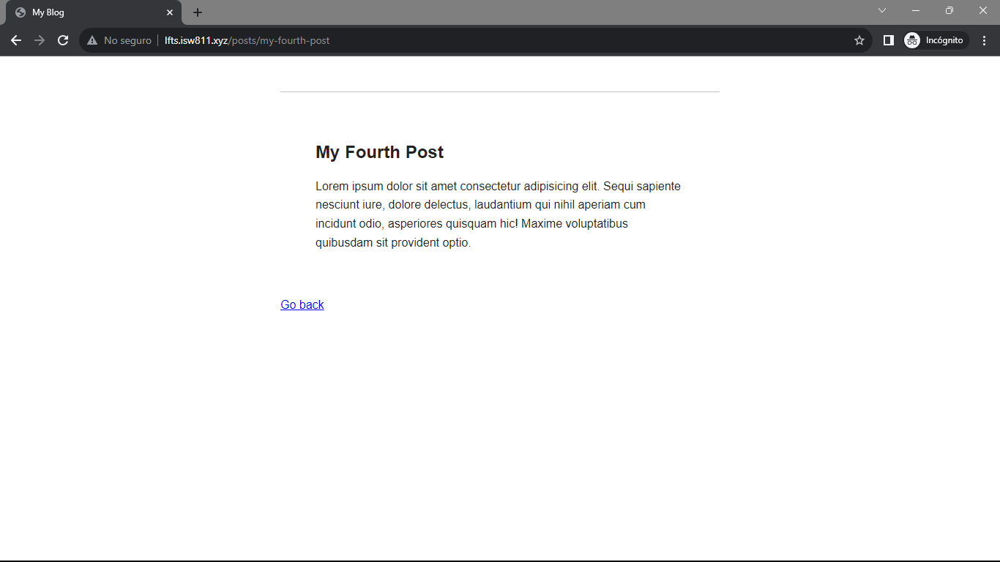

[< Volver a la pagina principal](/docs/readme.md)

# Find a Composer Package for Post Metadata

En este episodio, usaremos el Yaml Front Matter. Vamos a ver si podemos encontrar un paquete Composer que nos ayude a analizarlo. Esto nos dará una buena oportunidad de aprender lo fácil y útil que es Composer.

Instalamos la siguiente linea de codigo en la maquina virtual:


```bash
$ composer require spatie/yaml-front-matter
```
Esto instalara las librerias del Yaml Front Matter

Creamos otro archivo HTML, le llameros `my-fourth-post-html` 

```html
---

title: My Fourth Post
slug: my-fourth-post
excerpt: Lorem ipsum dolor sit amet consectetur adipisicing elit.
date: 2023-10-16

---


<p>
    Lorem ipsum dolor sit amet consectetur adipisicing elit. Sequi sapiente nesciunt iure, dolore delectus, laudantium
    qui nihil aperiam cum incidunt odio, asperiores quisquam hic! Maxime voluptatibus quibusdam sit provident optio.
</p>
```

Y además modificamos de igual forma los demás HTML ya creados previamente.

Despues modificaremos el archivo `Post.php`, en este archivo lo que hacemos es crear en la clase su respectivo constructor y arreglamos las funciones:

```php
<?php

namespace App\Models;

use Illuminate\Database\Eloquent\ModelNotFoundException;
use Illuminate\Support\Facades\File;
use PhpParser\Node\Expr\FuncCall;

class Post
{
    public $title;

    public $excerpt;

    public $date;

    public $body;

    public $slug;

    public function __construct($title, $excerpt, $date, $body, $slug)
    {
        $this->title = $title;
        $this->excerpt = $excerpt;
        $this->date = $date;
        $this->body = $body;
        $this->slug = $slug;
    }

    public static function all()
    {
        $files = File::files(resource_path("posts/"));

        return array_map(fn($file) => $file->getContents(), $files);
    }

    public static function find($slug)
    {
        base_path();
        if (!file_exists($path = resource_path("posts/{$slug}.html"))) {
            throw new ModelNotFoundException();
        }

        return cache()->remember("post.{$slug}", 1200, fn () => file_get_contents($path));
    }
}


```

Despues en el archivo `web.php` creamos un new post para así poder retonar dichos atributos

```php
Route::get('/', function () {

    $files = File::files(resource_path("posts/"));
    $posts = [];

    foreach ($files as $file) {
        $documents = YamlFrontMatter::parseFile($file);

        $posts[] = new Post(
            $documents->title,
            $documents->excerpt,
            $documents->date,
            $documents->body(),
            $documents->slug
        );
    }

    return view('posts', [
        'posts' => $posts]);
});

```

Y luego, regresamos al archivo `posts.blade.php` y los editamos para lograr llamar los atributos de la clase

```html
<body>
    <?php foreach ($posts as $post) : ?>
        <article>
            <h1>
                <a href="/posts/<?= $post->slug; ?>">
                    <?= $post->title; ?>
                </a>

            </h1>

            <div>
                <?= $post->excerpt; ?>
            </div>
        </article>
    <?php endforeach; ?>
</body>

```

Seguidamente, realizamos un ajuste al archivo `web.php` en cual creamos un `map()` para hacer más limpio el codigo.

```php
Route::get('/', function () {

    $posts = collect(File::files(resource_path("posts")))

        ->map(fn ($file) => YamlFrontMatter::parseFile($file))
        ->map(fn ($document) => new Post(
            $document->title,
            $document->excerpt,
            $document->date,
            $document->body(),
            $document->slug
        ));

    return view('posts', [
        'posts' => $posts
    ]);
});

```

Pero igualmente, volvemos a modidificar el codigo para que este quede aún más facil de entender haciendo lo siguiente:

Primero, nos vamos al archivo `Post.php` y modifcamos la funcion `all` agregando lo siguiente:

```php
 public static function all()
    {
        return collect(File::files(resource_path("posts")))

            ->map(fn ($file) => YamlFrontMatter::parseFile($file))
            ->map(fn ($document) => new Post(
                $document->title,
                $document->excerpt,
                $document->date,
                $document->body(),
                $document->slug
            ));
    }

```

Y ya luego, en el archivo de `web.php` arreglamos lo siguiente:

```php
Route::get('/', function () {

    return view('posts', [
        'posts' => Post::all()
    ]);
});
```

Para finalizar, editamos el archivo `Post.php` otra vez, pero esta vez modificamos la funcion `find()` haciendo lo siguiente:

```php
public static function find($slug)
{
    return static::all()->firstWhere('slug', $slug);
}
```

Posteriormente editamos el archivo `post.blade.php` con el siguiente codigo, esto abarca la parte del post individual.

```Html
<!DOCTYPE html>
<html lang="en">

<head>
    <meta charset="UTF-8">
    <meta name="viewport" content="width=device-width, initial-scale=1.0">
    <link rel="stylesheet" href="/app.css">
    <title>My Blog</title>
</head>

<body>
    <article>
        <h1><?= $post->title; ?></h1>

        <div>
            <?= $post->body; ?>
        </div>
    </article>

    <a href="/">Go back</a>
</body>

</html>
```

Vista de todos los posts:



Vista del post individual:




