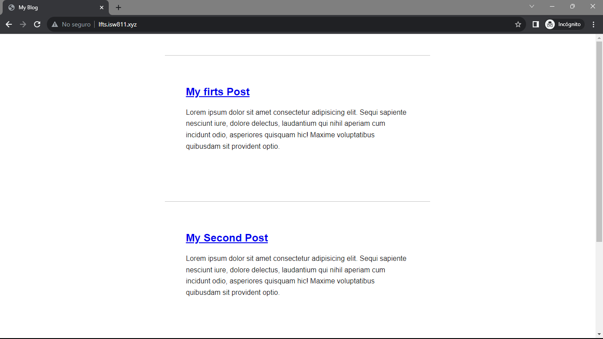
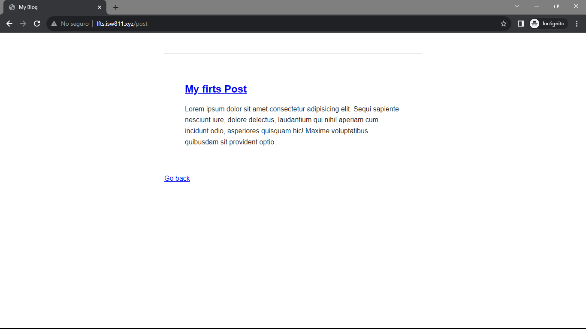

[< Volver a la pagina principal](/docs/readme.md)

# Make a Route and link to it

En este capitulo cambiamos el archivo "welcome.blade.php" que se encuentra en `/views/welcome.blade.php`, por `"posts.blade.php"`

Y en la parte de `/routes/web.php` cambiamos los siguiente:

```php
Route::get('/', function () {
    return view('post');
});
```

Ahora eliminamos el archivo `app.js` que se encuentra ubicado en la carpeta `/public` y despues nos movemos al archivo `posts.blade.php` y eliminamos la linea de codigo del script:

```html
<!DOCTYPE html>
<html lang="en">
<head>
    <meta charset="UTF-8">
    <meta name="viewport" content="width=device-width, initial-scale=1.0">
    <link rel= "stylesheet" href="/app.css">
    <title>My Blog</title>
</head>
<body>
    <h1>Hello World</h1>
</body>
</html>
```

Ahora modificamos el archivo `app.css`:

```css
body {
    background: white;
    color: #222222;
}
```

Despues modificamos el archivo `posts.blade.php`:

```html
<!DOCTYPE html>
<html lang="en">
<head>
    <meta charset="UTF-8">
    <meta name="viewport" content="width=device-width, initial-scale=1.0">
    <link rel= "stylesheet" href="/app.css">
    <title>My Blog</title>
</head>
<body>
    <article>
        <h1>My firts Post</h1>

        <p>
            Lorem ipsum dolor sit amet consectetur adipisicing elit. Sequi sapiente nesciunt iure, dolore delectus, laudantium qui nihil aperiam cum incidunt odio, asperiores quisquam hic! Maxime voluptatibus quibusdam sit provident optio.
        </p>
    </article>
</body>
</html>
```

Y luego volvemos a modificar el archivo css:

```css
body {
    background: white;
    color: #222222;
    max-width: 600px;
    margin: auto;
    font-family: sans-serif;
}

p{
    line-height: 1.6;
}
```

Agregamos otro article en el archivo `posts.blade.php`:

```html
<!DOCTYPE html>
<html lang="en">
<head>
    <meta charset="UTF-8">
    <meta name="viewport" content="width=device-width, initial-scale=1.0">
    <link rel= "stylesheet" href="/app.css">
    <title>My Blog</title>
</head>
<body>
    <article>
        <h1>My firts Post</h1>

        <p>
            Lorem ipsum dolor sit amet consectetur adipisicing elit. Sequi sapiente nesciunt iure, dolore delectus, laudantium qui nihil aperiam cum incidunt odio, asperiores quisquam hic! Maxime voluptatibus quibusdam sit provident optio.
        </p>
    </article>

    <article>
        <h1>My Second Post</h1>

        <p>
            Lorem ipsum dolor sit amet consectetur adipisicing elit. Sequi sapiente nesciunt iure, dolore delectus, laudantium qui nihil aperiam cum incidunt odio, asperiores quisquam hic! Maxime voluptatibus quibusdam sit provident optio.
        </p>
    </article>
</body>
</html>
```

y volvemos a modificar el archivo css para dar un poco de margin y padding al archivo, para que se vea con un mejor estilo:

```css
article{
    margin-top: 3rem;
    padding: 3rem;
    border-top: 1px solid #c5c5c5; 
}
```

Ahora lo que haremos es agregar una nueva ruta en la carpeta routes, en el archivo `web.php` para dirigir los post que se encuentran el archivo de `post.blade.php`

```css
article{
    margin-top: 3rem;
    padding: 3rem;
    border-top: 1px solid #c5c5c5; 
}
```

Despues de esto creamos un archivo en la carpeta resources el cual se llamará `post.blade.php` para poder rediriguir el "My firt post" ha otra ruta y agregamos lo siguiente:

```html
<!DOCTYPE html>
<html lang="en">
<head>
    <meta charset="UTF-8">
    <meta name="viewport" content="width=device-width, initial-scale=1.0">
    <link rel= "stylesheet" href="/app.css">
    <title>My Blog</title>
</head>
<body>
    <article>
        <h1><a href="/post">My firts Post</a></h1>

        <p>
            Lorem ipsum dolor sit amet consectetur adipisicing elit. Sequi sapiente nesciunt iure, dolore delectus, laudantium qui nihil aperiam cum incidunt odio, asperiores quisquam hic! Maxime voluptatibus quibusdam sit provident optio.
        </p>
    </article>

    <a href="/">Go back</a>
</body>
</html>
```

Así se deberia de ver la ruta posts:



y así la ruta post:




