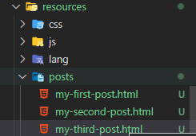
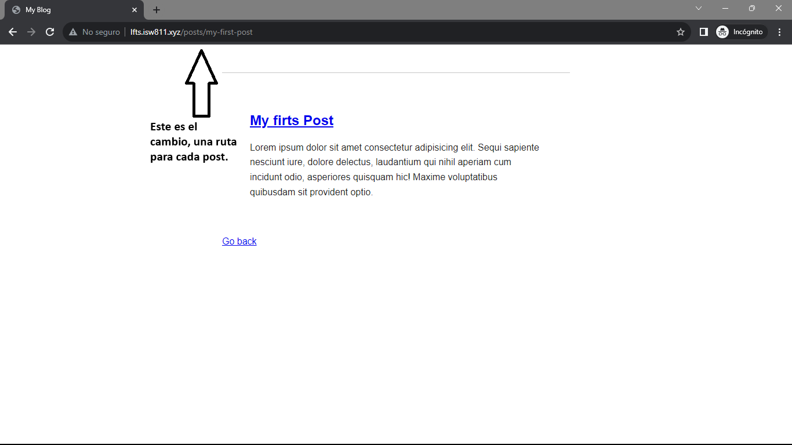

[< Volver a la pagina principal](/docs/readme.md)

# Store Blog Posts as HMTL Files

En este capitulo lo que se hará es, primero se modificara el archivo `post.blade.php` para hacer de forma más dinamica y eficiente los de las rutas de los post y de esta manera almacenar estos post como archivos html:

```html
<!DOCTYPE html>
<html lang="en">
<head>
    <meta charset="UTF-8">
    <meta name="viewport" content="width=device-width, initial-scale=1.0">
    <link rel= "stylesheet" href="/app.css">
    <title>My Blog</title>
</head>
<body>
    <article>
        <?= $post; ?>
    </article>

    <a href="/">Go back</a>
</body>
</html>
```

Luego se modifica el archivo `web.php` cambiando lo siguiente:

```php
Route::get('post', function () {
    return view('post', [
        'post' => '<h2>Hello World</h1>' // $post
    ]);
});
```

Despues de esto, lo que haremos es crear una carpeta que se llamará `post` dentro de la carpeta de `resources` y en esa carpeta de `post` crearemos tres archivos html:



Y en cada unos de estos HTML escribiremos su respectivo post

```html
     <h1><a href="/post">My firts Post</a></h1>

    <p>
        Lorem ipsum dolor sit amet consectetur adipisicing elit. Sequi sapiente nesciunt iure, dolore delectus, laudantium qui nihil aperiam cum incidunt odio, asperiores quisquam hic! Maxime voluptatibus quibusdam sit provident optio.
    </p>
```

Por ultimo, modificaremos el archivo `web.php`, en este archivo lo que se realizo fue que se pudiera mover entre los post almacenados en html de forma mas dinamica

```php
Route::get('posts/{post}', function ($slug) {

    $path = __DIR__ . "/../resources/posts/{$slug}.html"

    if (! file_exists($path)){
       return redirect('/');
    }

    $post = file_get_contents($path);


    return view('post', [
        'post' => $post
    ]);
});
```

Y ya para finalizar, cambiamos la rutas de los post en el archivo `posts.blade.php`

```html
<!DOCTYPE html>
<html lang="en">
<head>
    <meta charset="UTF-8">
    <meta name="viewport" content="width=device-width, initial-scale=1.0">
    <link rel= "stylesheet" href="/app.css">
    <title>My Blog</title>
</head>
<body>
    <article>
        <h1><a href="/posts/my-first-post">My firts Post</a></h1>

        <p>
            Lorem ipsum dolor sit amet consectetur adipisicing elit. Sequi sapiente nesciunt iure, dolore delectus, laudantium qui nihil aperiam cum incidunt odio, asperiores quisquam hic! Maxime voluptatibus quibusdam sit provident optio.
        </p>
    </article>

    <article>
    <h1><a href="/posts/my-second-post">My Second Post</a></h1>

        <p>
            Lorem ipsum dolor sit amet consectetur adipisicing elit. Sequi sapiente nesciunt iure, dolore delectus, laudantium qui nihil aperiam cum incidunt odio, asperiores quisquam hic! Maxime voluptatibus quibusdam sit provident optio.
        </p>
    </article>

    <article>
    <h1><a href="/posts/my-third-post">My Third Post</a></h1>

        <p>
            Lorem ipsum dolor sit amet consectetur adipisicing elit. Sequi sapiente nesciunt iure, dolore delectus, laudantium qui nihil aperiam cum incidunt odio, asperiores quisquam hic! Maxime voluptatibus quibusdam sit provident optio.
        </p>
    </article>
</body>
</html>
```

Así se deberia de ver:




