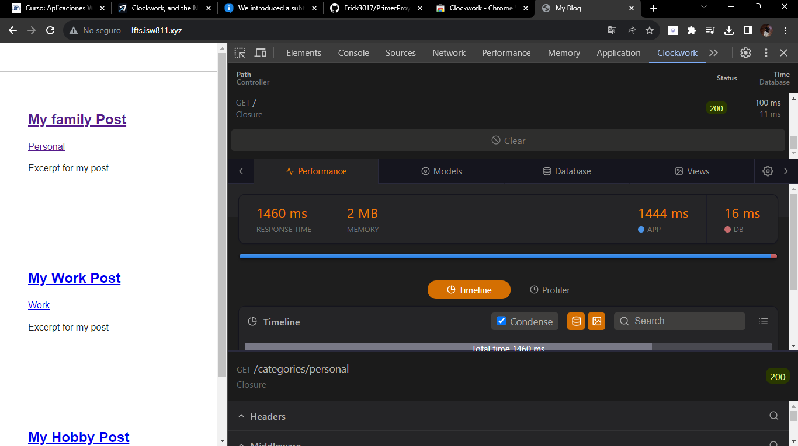
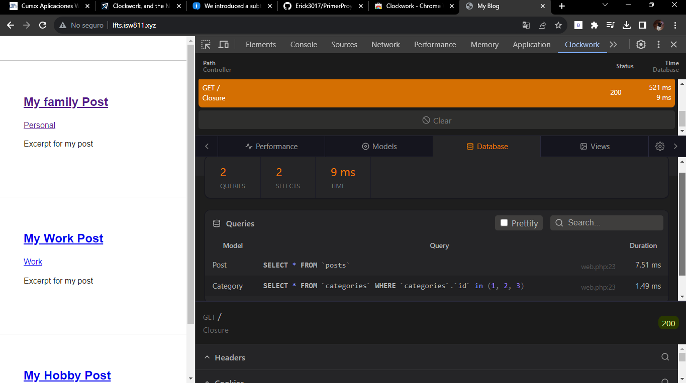

[< Volver a la pagina principal](/docs/readme.md)

# Clockwork, and the N+1 Problem

Introdujimos un sutil problema de rendimiento en el episodio anterior que se conoce como el problema N+1. Debido a que Laravel lazy  carga relaciones, esto significa que puede caer potencialmente en una trampa donde se ejecuta una consulta SQL adicional para cada elemento dentro de un bucle. Cincuenta elementos... cincuenta consultas SQL. 

En este episodio, depuraremos estas consultas, tanto manualmente, como con la excelente extensión de Clockwork y luego resolveremos el problema cargando ansiosamente cualquier relación a la que hagamos referencia.

Para comenzar, abriremos nuestra maquina virtual en `/vagrant/sites/lfts.isw811.xyz` y ejecutaremos el siguiente comando:

```bash
composer require itsgoingd/clockwork
```

Ahora nos iremos a nuestro navegador e instalaremos la extensión llamada `Clockwork`:

Después, la podremos visualizar dándole click derecho dentro de la pagina y seleccionar inspeccionar, y luego buscar la opción de `Clockwork`.



Ahora para arreglar el problema de rendimiento, nos iremos al archivo `web.php` y y modificaremos lo siguiente, esto es para que busque todos las categorías mediante los id existentes:

```php
Route::get('/', function () {

    return view('posts', [
        'posts' => Post::with('category')->get()
    ]);
});
```

Así se debería de ver en la pagina utilizando la extensión de `Clockwork`:

