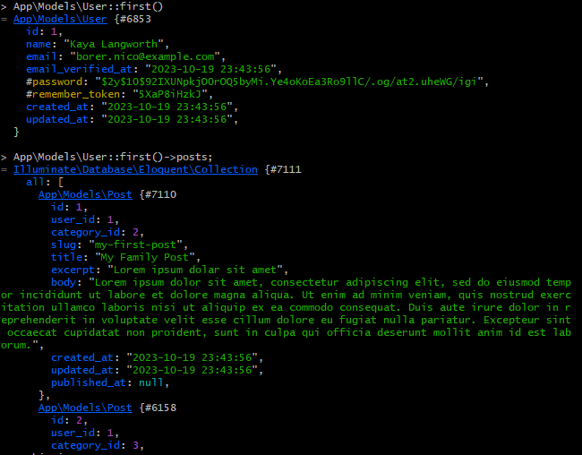
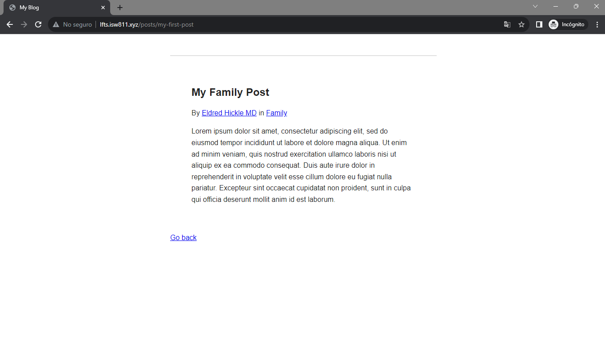

[< Volver a la pagina principal](/docs/readme.md)

# Database Seeding Saves Time

En este episodio, asociaremos una publicación de blog con un autor o usuario en particular. En el proceso de agregar esto nos encontraremos de nuevo con el problema de la necesidad de repoblar manualmente nuestra base de datos. 

Sin embargo, este podría ser un buen momento para tomar unos momentos para revisar la siembra de la base de datos.

Para empezar nos iremos al archivo `2023_10_18_110233_create_posts_table.php` y agregaremos un nuevo atrubito llamado `user_id`.

```php
$table->foreignId('user_id');
```

Seguidamente, nos iremos a la maquina virtual nos ubicamos en `/vagrant/sites/lfts.isw811.xyz` y ejecutamos el siguiente codigo para borrar las tablas y volverlas a crear.

```bash
php artisan migrate:fresh
```

Ahora, arreglaremos que cuando ejecutemos el comando anterior no haya que otra vez crear todos los datos de cada unas de las tablas a mano.

Pero primero nos iremos al archivo `DatabaseSeeder.php` que se encuentra ubicado en la carpeta `seeders` y agregamos lo siguiente para crear los datos de nuestras tablas mediante un comando en la maquina virtual.

```php
<?php

namespace Database\Seeders;

use App\Models\Category;
use App\Models\User;
use App\Models\Post;
use Illuminate\Database\Seeder;

class DatabaseSeeder extends Seeder
{
    /**
     * Seed the application's database.
     *
     * @return void
     */
    public function run()
    {

        User::truncate();
        Post::truncate();
        Category::truncate();

        $user = User::factory()->create();

        $personal = Category::create([
            'name' => 'Personal',
            'slug' => 'personal'

        ]);

        $family = Category::create([
            'name' => 'Family',
            'slug' => 'family'

        ]);

        $work = Category::create([
            'name' => 'Work',
            'slug' => 'work'

        ]);

        Post::create([
            'user_id' => $user->id,
            'category_id' => $family->id,
            'title' => 'My Family Post',
            'slug' => 'my-first-post',
            'excerpt' => '<p>Lorem ipsum dolar sit amet.</p>',
            'body' => '<p>Lorem ipsum dolor sit amet, consectetur adipiscing elit, sed do eiusmod tempor incididunt ut labore et dolore magna aliqua. Ut enim ad minim veniam, quis nostrud exercitation ullamco laboris nisi ut aliquip ex ea commodo consequat. Duis aute irure dolor in reprehenderit in voluptate velit esse cillum dolore eu fugiat nulla pariatur. Excepteur sint occaecat cupidatat non proident, sunt in culpa qui officia deserunt mollit anim id est laborum.</p>' 
        ]);

        Post::create([
            'user_id' => $user->id,
            'category_id' => $work->id,
            'title' => 'My Work Post',
            'slug' => 'my-work-post',
            'excerpt' => '<p>Lorem ipsum dolar sit amet</p>',
            'body' => '<p>Lorem ipsum dolor sit amet, consectetur adipiscing elit, sed do eiusmod tempor incididunt ut labore et dolore magna aliqua. Ut enim ad minim veniam, quis nostrud exercitation ullamco laboris nisi ut aliquip ex ea commodo consequat. Duis aute irure dolor in reprehenderit in voluptate velit esse cillum dolore eu fugiat nulla pariatur. Excepteur sint occaecat cupidatat non proident, sunt in culpa qui officia deserunt mollit anim id est laborum.</p>' 
        ]);

    }
}
```

Ahora, nos iremos al archivo `2023_10_19_201010_create_categories_table.php` para modificar los atributos `name` y `slug` para que no se puedan repetir con el siguiente método: `unique()`

```php
$table->string('name')->unique();
$table->string('slug')->unique();
```

Y ya después de esto, nos iremos a la maquina virtual y ejecutaremos el siguiente comando para borrar,refrescar y crear las tablas con datos automáticamente: 

```bash
 php artisan migrate:fresh --seed
```

Ahora nos vamos al archivo `Post.php` y creamos una nueva relación con eloquent pero esta vez para el `User`:

```php
public function user()
    {
        return $this->belongsTo(User::class);
    }
```

Ahora nos vamos al archivo `User.php` y agregamos la siguiente función:

```php
 public function post()
    {
        return $this->hasMany(Post::class);
    }
```
Posteriormente, regresamos a la maquina virtual y ejecutamos el siguiente comando para hacer búsquedas:

```bash
php artisan tinker
```

Y seguidamente ejecutamos los siguiente comandos para ver la relación Usuario-post:



Y por ultimo, agregamos lo siguiente en el archivo `post.blade.php` para ver el usuario de ese post.

```php
<p>
    By <a href="#">{{ $post->user->name}}</a> in <a href="/categories/{{$post->category->slug}}">{{$post->category->name}}</a>
</p>
```

Y así se tendría que ver la pagina web:




