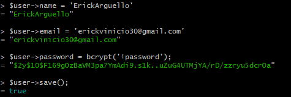
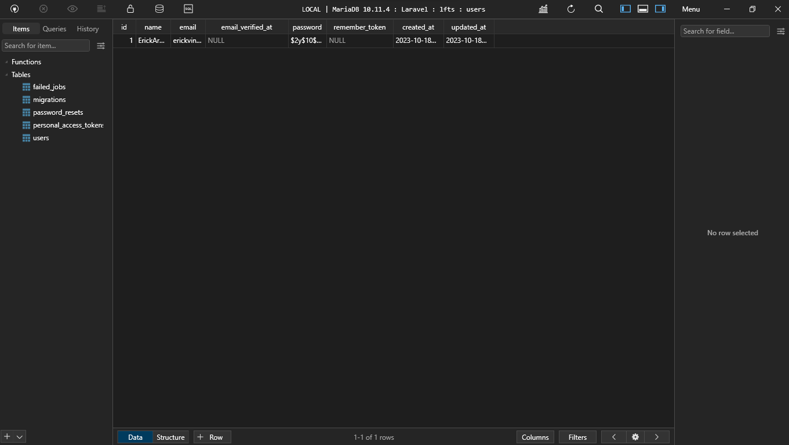

[< Volver a la pagina principal](/docs/readme.md)

# Eloquent and the Active Record Pattern

Pasemos ahora a Eloquent, que es la implementación de Active Record de Laravel. 

Eloquent nos permite asignar un registro de tabla de base de datos a un objeto elocuente correspondiente. 

En este episodio, aprenderás la API inicial.

Empezamos revirtiendo los cambios realizados en el archivo `2014_10_12_000000_create_users_table.php`:

```php
public function up()
    {
        Schema::create('users', function (Blueprint $table) {
            $table->id();
            $table->string('name');
            $table->string('email')->unique();
            $table->timestamp('email_verified_at')->nullable();
            $table->string('password');
            $table->rememberToken();
            $table->timestamps();
        });
    }
```

Seguidamente, abrimos la maquina virtual y ejecutamos el comando `fresh`, para borrar y volver a crear las tablas de migrate:

```bash
php artisan migrate:fresh
```

Revisamos si la base de dato en `TablePLus` se actualizo y si es así, volvemos a la maquina virtual y ejecutamos el siguiente comando para crear un usuario:

```bash
php artisan tinker
```

Después, ejecutamos los siguientes tres comandos para crear el usuario

* Primero:

```bash
$user = new App\Models\User;
```

* Segundo

```bash
$user = new User;
```

* Tercero, en la siguiente imagen se muestra los comandos para crear los atributos del usuario:



Así se tiene que ver en la base de datos:



Con el siguiente comando puedes ver el usuario previamente creado en la maquina virtual:

```bash
$user
```

Y con el siguiente comando podemos actualizar el atributo a elegir del usuario:

```bash
$user->(atributo a cambiar) = " "
```

Ejemplo: 

```bash
$user->name = "IanArguello";
```

Con el siguiente comando podemos buscar un usuario mediante `ID`:

```bash
User::find('Id a buscar');
```

Con el siguiente comando podemos ver todos los usuarios:

```bash
User::all();
```

Con el siguiente comando podemos ver unicamente los nombres de los usuarios:

```bash
$user->pluck('name');
```

Con el siguiente comando podemos ver el primer usuario creado:

```bash
$user->first();
```


