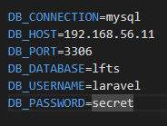
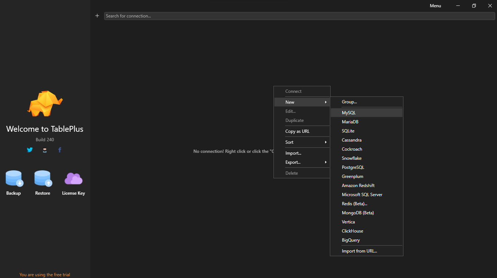
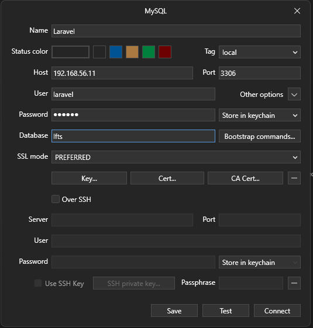
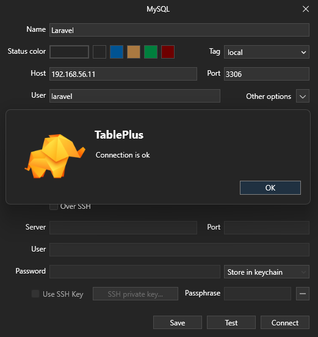
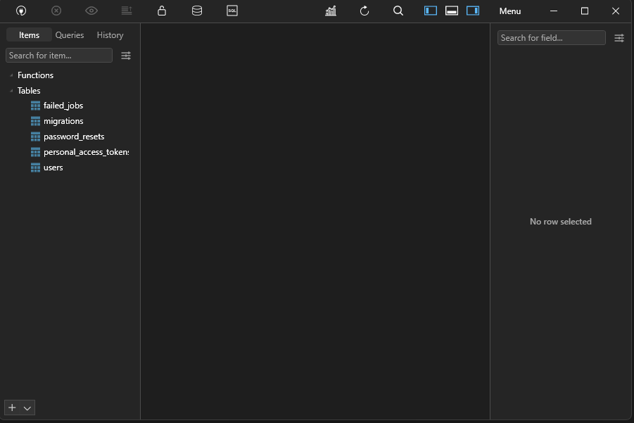

[< Volver a la pagina principal](/docs/readme.md)

# Environment Files and Database Connections

Cada aplicación requerirá una cierta cantidad de configuración específica del entorno. Ejemplos de esto pueden ser el nombre de la base de datos a la que te estás conectando, o qué host de correo y puerto usa tu aplicación, o incluso claves especiales y tokens secretos que te proporcionan las API de terceros. 

Puedes almacenar la configuración de esta manera dentro de su archivo .env, que se encuentra en la raíz de su proyecto. 



En este episodio, discutiremos los elementos esenciales de los archivos de entorno, y luego pasaremos a conectarnos a una base de datos MySQL 

Para comenzar, nos iremos a nuestra maquina virtual y instalamos el mysql con el siguiente comando:

```bash
brew install mysql
```

Despues nos conectamos a mysql con el siguiente comando:

```bash
mysql -u laravel -h 192.168.56.11 -p
```

Le van a pedir un contraseña la cual es la que tienen en su archivo punto .env en la parte de `DB_PASSWORD`, en este ejemplo seria `secret`

Despues, creamos la base de datos y le llamamos `lfts` con el siguiente comando:

```bash
create database lfts;
```

Ahora nos salimos de mysql y volvemos a la maquina virtual para migrar tablas a la base de datos.

Una vez en la maquina virtual ejecutamos el siguiente comando:

```bash
php artisan migrate;
```

Volvemos a conectarnos otra vez al mysql y ejecutamos el siguiente comando para usar nuestra base de datos ya creada:

```bash
use blog;
```

Y después, ejecutamos el siguiente comando para ver la tablas en nuestra base de datos:

```bash
show tables;
```

Ahora nos iremos a internet y instalaremos una aplicacion de base de datos, puede ser `Sequel Pro`, `Mysql Workbench` o `TablePlus`.

En este caso, utilizaremos `TablePlus`.

Una vez instalada la aplicación, la abrimos y presionamos click derecho del mouse, seleccionamos `new` y seguidamente `MySQL`



Nos saldara una ventana y escribiremos los datos que concuerden con los que tenemos en el .env, en mi caso sería así:



Después, presionamos donde en el boton que dice `Test` y nos tiene que salir el siguiente mensaje mencionando que todo esta correcto:



Seguidamente, presionamos el boton `save` y abrimos nuestra base dando doble click sobre nuestra base de datos creada.




