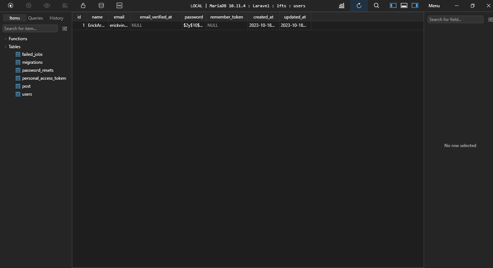
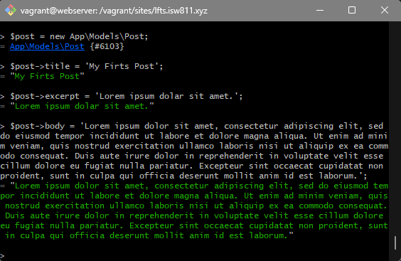

[< Volver a la pagina principal](/docs/readme.md)

# Make a Post Model and Migration

Ahora que estamos un poco más familiarizado con las clases de migración y los modelos elocuentes, vamos a aplicar este aprendizaje a nuestro proyecto. Eliminaremos la antigua implementación basada en archivos del capítulo anterior y la reemplazaremos con un nuevo modelo Post Eloquent. 

También prepararemos una migración para construir la tabla de publicaciones. Empezamos eliminando el archivo `Post.php` que se encuentra en la carpeta `Models`, dentro de la carpeta `app`.

Posteriormente, abrimos nuestra maquina virtual y la ubicamos en `/vagrant/sites/lfts.isw811.xyz`.

Luego ejecutamos el siguiente comando para crear un nuevo archivo de migración:

```bash
php artisan make:migration create_post_table
```

A continuación, eliminamos la carpeta `post` que se encuentra ubicada dentro de la carpeta de `resources`

Y después de esto, modificamos la función `up` en el archivo creado anteriormente `2023_10_18_103039_create_post_table`, este archivo se encuentra en la carpeta migrations, dentro de la carpeta database:

```php
public function up()
    {
        Schema::create('post', function (Blueprint $table) {
            $table->id();
            $table->string('title');
            $table->text('excerpt');
            $table->text('body');
            $table->timestamps();
            $table->timestamp('published_at')->nullable();
        });
    }
```

Seguidamente, volvemos a la maquina virtual y ejecutamos el siguiente comando para crear la tabla post en la base de datos:

```bash
php artisan migrate
```

Así se tendría que ver en la base de datos:



Ahora en la maquina virtual ejecutamos el siguiente comando para crear el model de la tabla post ya creada:

```bash
php artisan make:model Post
```

Ahora volvemos a la maquina virtual otra vez y ejecutamos el siguiente comando para abrir una terminal de php:

```bash
php artisan tinker
```

Listo, dentro de esa terminal ejecutamos el siguiente comando con el cual podemos ver todos los posts creados:

```bash
 App\Models\Post::all();
```

A continuación, crearemos un `post` con los siguientes comandos:

Primero creamos la instancia
```bash
 $post = new App\Models\Post::all();
```

Seguidamente creamos el usuario con los siguiente comandos de la imagen:



Ejecutamos el siguiente comando para guardar el post creado;

```bash
$post->save();
```

Con el siguiente comando podemos buscar un post mediante `ID`:

```bash
Post::find('Id a buscar');
```

Con el siguiente comando podemos ver todos los posts creados:

```bash
Post::all();
```

Con el siguiente comando podemos ver el primer post creado:

```bash
$post->first();
```

Ahora editamos el archivo `web.php` cambiando el `slug` por `id`.

```php
Route::get('posts/{post}', function ($id) {

    return view('post', [
        'post' => Post::findOrFail($id)
    ]);
});
```

Y seguidamente, cambiamos también el archivo `posts.blade.php`, igualmente cambiando el `slug` por `id`.

```php
<article>
        <h1>
            <a href="/posts/{{ $post->id }}">
                {{ $post->title }}
            </a>

        </h1>

        <div>
            {{ $post->excerpt }}
        </div>
    </article>
```