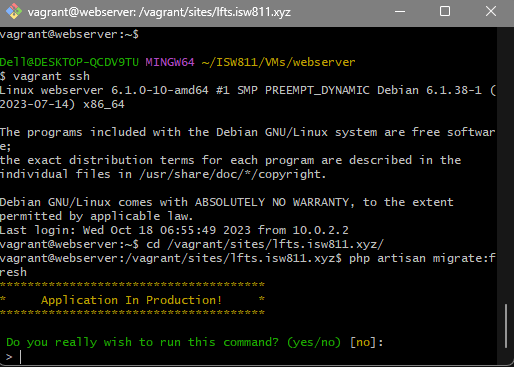
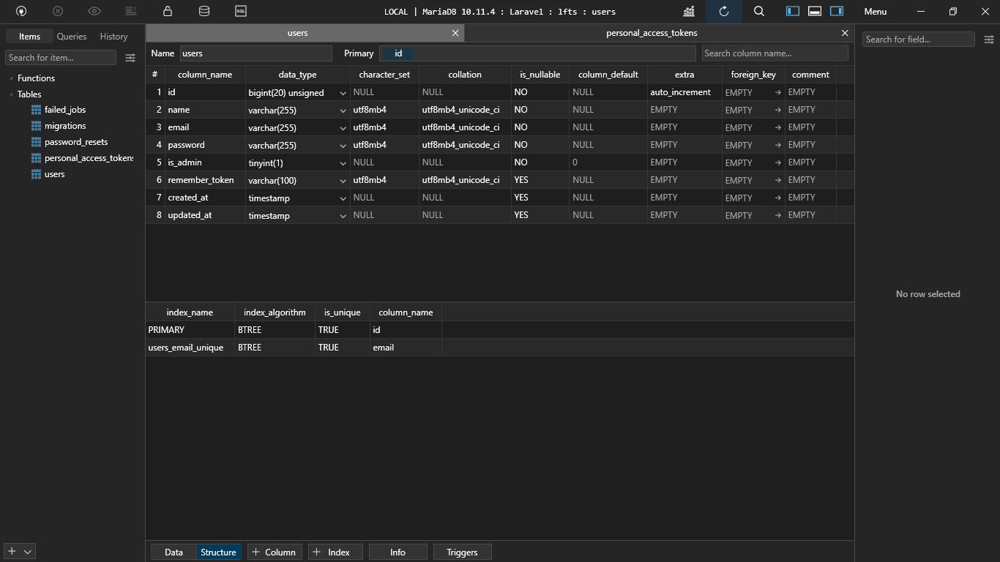
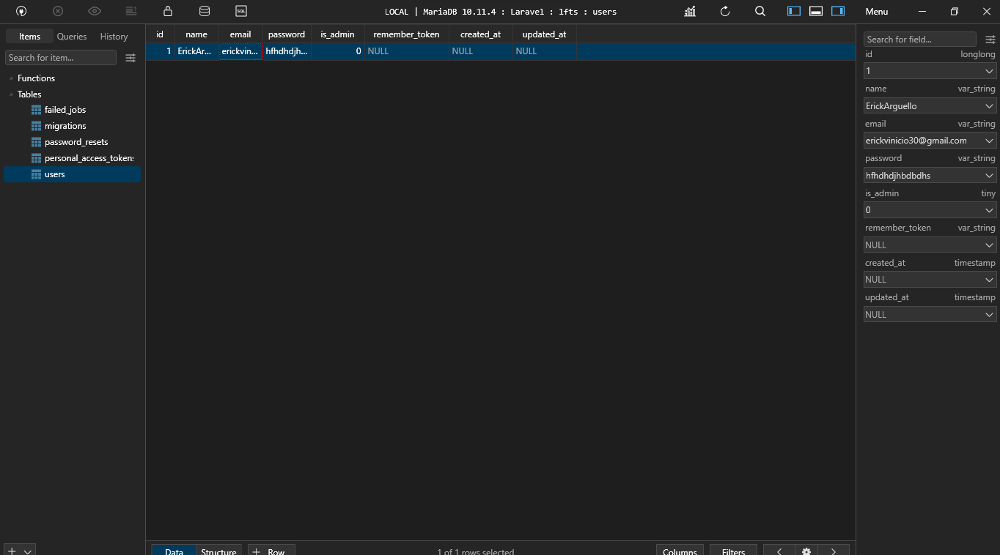
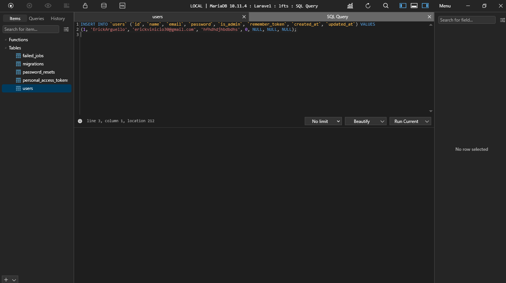

[< Volver a la pagina principal](/docs/readme.md)

# Migrations: The Absolute Basics

Ahora que nos hemos conectado correctamente a MySQL, cambiemos nuestra atención a esas misteriosas clases de migración. Piense en una migración como un plano técnico para una tabla de base de datos.

Primeramente, existe un comando para revocar las tablas de migración creadas, el cual es el siguiente:

```bash
php artisan migrate:rollback
```

También hay un comando el cual borra todas la tablas de migración y al mismo tiempo las vuelve a crear, es decir como hacer un refresh:

```bash
php artisan migrate:fresh
```

En si, este comando nunca hay que correrlo estando ya en producción, pero hay una ventaja que si corres ese comando estando en producción te mandará la siguiente advertencia:



Ahora nos vamos a la carpeta `database`, presionamos la carpeta `migrations` y seleccionamos el archivo `2014_10_12_000000_create_users_table.php` y eliminamos la linea de codigo para verificar el correo y agregamos un boolean de si es el usuario es admin o no lo es:

```php
 public function up()
    {
        Schema::create('users', function (Blueprint $table) {
            $table->id();
            $table->string('name');
            $table->string('email')->unique();  
            $table->string('password');
            $table->boolean('is_admin')->default(false);
            $table->rememberToken();
            $table->timestamps();
        });
    }
```

Y después de esto ejecutamos los siguientes comandos para establecer los cambios:

```bash
 php artisan migrate:rollback
```

Después este otro para volver a crear las tablas de migración:

```bash
 php artisan migrate
```

Revisamos la base de datos a ver si se actualizaron los cambios:



Dentro de la base de datos podemos crear un usuario ya sea a mano o mediante código.

A mano sería presionar la tabla `user` y presionar el botón `+ Row` y ir creando el usuario atributo por atributo



Pero también esta la opción de crear el usuario mediante un sql Query:




