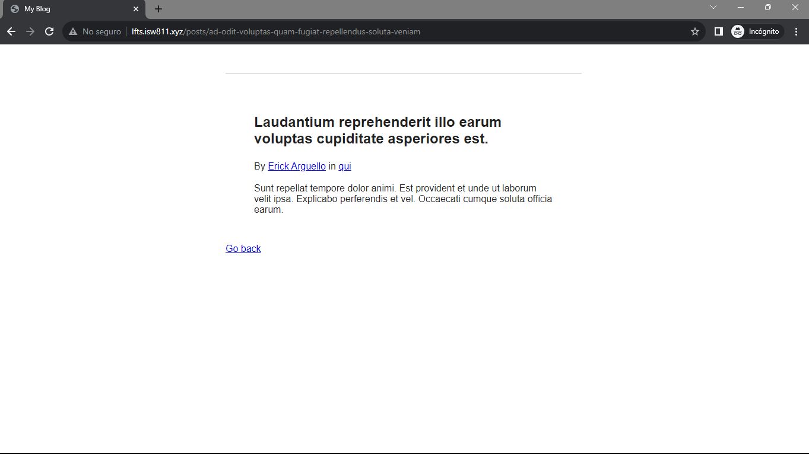

[< Volver a la pagina principal](/docs/readme.md)

# Turbo Boost With Factories

Ahora que comprendemos los conceptos básicos de los propagadores de bases de datos.

En este episodio, vamos a integrar las fábricas de modelos para generar sin problemas cualquier número de registros en la base de datos.

Para dar inicio, primero conoceremos el siguiente comando con el cual podemos crear los usuarios que queramos, dentro del método `factory()` digitamos los usuarios a crear:

```bash
App\Models\User::factory()->create();
```

Ahora en la maquina virtual ejecutamos el siguiente comando para crear un arhivo `PostFactory` para poder generar post cuantos posts queramos en la base de datos.

```bash
php artisan make:factory PostFactory
```

Después, de haber creado dicho archivo, nos ubicaremos en el y agregamos la siguiente función para poder crear los posts.

```php
<?php

namespace Database\Factories;

use App\Models\User;
use App\Models\Category;
use Illuminate\Database\Eloquent\Factories\Factory;

class PostFactory extends Factory
{
    /**
     * Define the model's default state.
     *
     * @return array
     */
    public function definition()
    {
        return [
            'user_id' => User::factory(),
            'category_id' => Category::factory(),
            'title' => $this->faker->sentence,
            'slug' => $this->faker->slug,
            'excerpt' => $this->faker->sentence,
            'body' => $this->faker->paragraph
        ];
    }
}
```

Ahora volvemos a la maquina virtual y ejecutamos el siguiente comando para borrar y crear las tablas:

```bash
php artisan migrate:fresh
```

Posteriormente, ejecutamos el siguiente comando para crear un archivo `CategoryFactory`, para poder genera las categorías que necesitemos.

```bash
php artisan make:factory CategoryFactory
```

Nos vamos al archivo creado y agregamos el siguiente código.

```php
<?php

namespace Database\Factories;

use Illuminate\Database\Eloquent\Factories\Factory;

class CategoryFactory extends Factory
{
    /**
     * Define the model's default state.
     *
     * @return array
     */
    public function definition()
    {
        return [
            'name' => $this->faker->word,
            'slug' => $this->faker->slug
        ];
    }
}
```

Ahora después de esto, volvemos a la maquina virtual y ingresamos al browser con el siguiente comando:

```bash
php artisan tinker
```

Ahora dentro del browser, ejecutamos el siguiente comando para crear los post:

```bash
App\Models\Post::factory()->create();
```

Ahora para probar, nos iremos al archivo `DatabaseSeeder.php` y modificaremos la función `run()` para crear un solo usuario para 5 posts: 

```php
public function run()
    {
        $user = User::factory()->create([
            'name' => 'Erick Arguello'
        ]);


        Post::factory(5)->create([
            'user_id' => $user->id
        ]);
    }
```

Y después, nos iremos a la maquina virtual para ejecutar el siguiente comando que borra, refresca y crea con datos las tablas de la base de datos:

```bash
php artisan migrate:fresh --seed
```

Y esto lo podemos verificar en la base de datos:


Y así se vería la pagina web:





