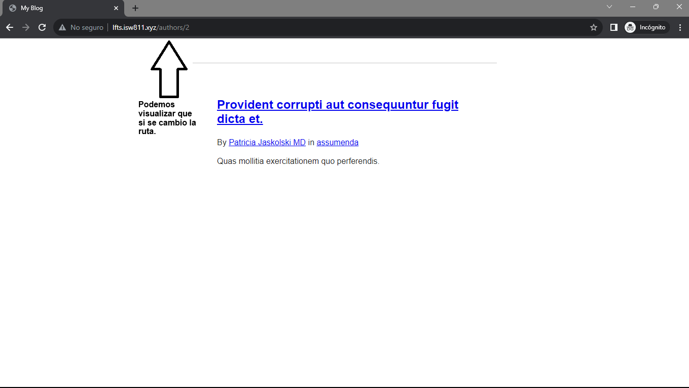
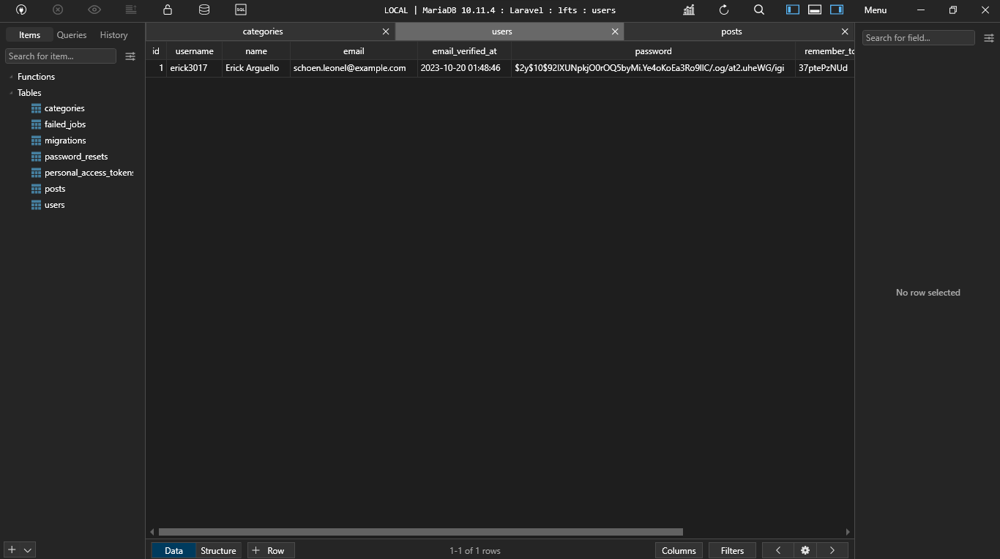
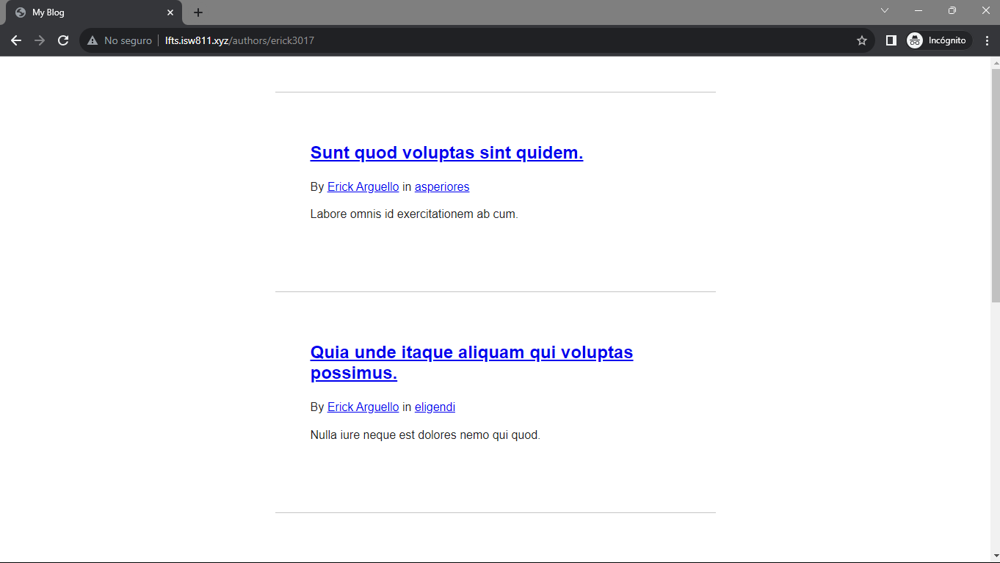

[< Volver a la pagina principal](/docs/readme.md)

# View All Posts By An Author

Ahora que podemos asociar una entrada de blog con un autor.

El siguiente paso que haremos en este episodio es crear una nueva ruta que represente todas las entradas de blog escritas por un autor en particular.

Iniciamos modificando el archivo `web.php`, en donde llamamos la función `latest()` para ordenar los post de forma descendente, es decir, del ultimo post que se creo al primero.

```php
Route::get('/', function () {

    return view('posts', [
        'posts' => Post::latest()->with('category')->get()
    ]);
});
```

Ahora nos movemos al archivo `post.blade.php` y a agregamos la siguiente linea de código:

```html
<p>
     By <a href="#">{{ $post->author->name}}</a> in <a href="/categories/{{$post->category->slug}}">{{$post->category->name}}</a>
</p>
```

E igualmente lo hacemos en el archivo `posts.blade.php`.

Ahora nos vamos al archivo `post.php` y modificamos la función `user` y le cambiamos el nombre `author`, y también editamos le return.

```php
public function author()
    {
        return $this->belongsTo(User::class, 'user_id');
    }
```

Y ahora nos ubicamos otra vez en el archivo `web-php` y modificamos la ruta para poder manejarla con `author` y agregamos una nueva ruta.

```php
Route::get('/', function () {

    return view('posts', [
        'posts' => Post::latest()->with(['category', 'author'])->get()
    ]);
});
```

```php
Route::get('authors/{author}', function (User $author) {

    return view('posts', [
        'posts' => $author->posts
    ]);
});
```

Ahora nos vamos a los archivos `posts.blade.php` y `post.blade.php`, y volvemos a editar el componente html `<p>`.

```html
<p>
    By <a href="/authors/{{ $post->author->id }}">{{ $post->author->name}}</a> in <a href="/categories/{{$post->category->slug}}">{{$post->category->name}}</a>
</p>
```

Y verificamos la pagina web a ver si surgieron los cambios.



Ahora nos vamos al archivo `2023_10_18_110233_create_users_table` y actualizamos agregando un nuevo atributo llamado `username`, para que nos aparezca el `username` en vez del `id`.

```php
$table->string('username')->unique();
```

Posteriormente, nos trasladamos al archivo `UserFactory.php` para igualmente agregar un atributo `username`.

```bash
'username' => $this->faker->unique()->username
```

Seguidamente nos vamos para la maquina virtual y ejecutamos el comando para eliminar, refrescar y volver a crear las tablas pero con datos ya incluidos a la base de datos.

```bash
php artisan migrate:fresh --seed
```

Verificamos en la base de datos:



Ahora volvemos a modificar los archivos `posts.blade.php` y `post.blade.php`, editando el componente html `<p>`, para que se muestre el `username` en vez de el `id`.

```html
<p>
     By <a href="/authors/{{ $post->author->username }}">{{ $post->author->name}}</a> in <a href="/categories/{{$post->category->slug}}">{{$post->category->name}}</a>
</p>
```

Y para finalizar, nos ubicamos en el archivo `web.php` y modificamos la ruta agregando el `username`.

```php
Route::get('authors/{author:username}', function (User $author) {

    return view('posts', [
        'posts' => $author->posts
    ]);
});
```

Verificamos la pagina web, se tendría que observar de la siguiente manera:


