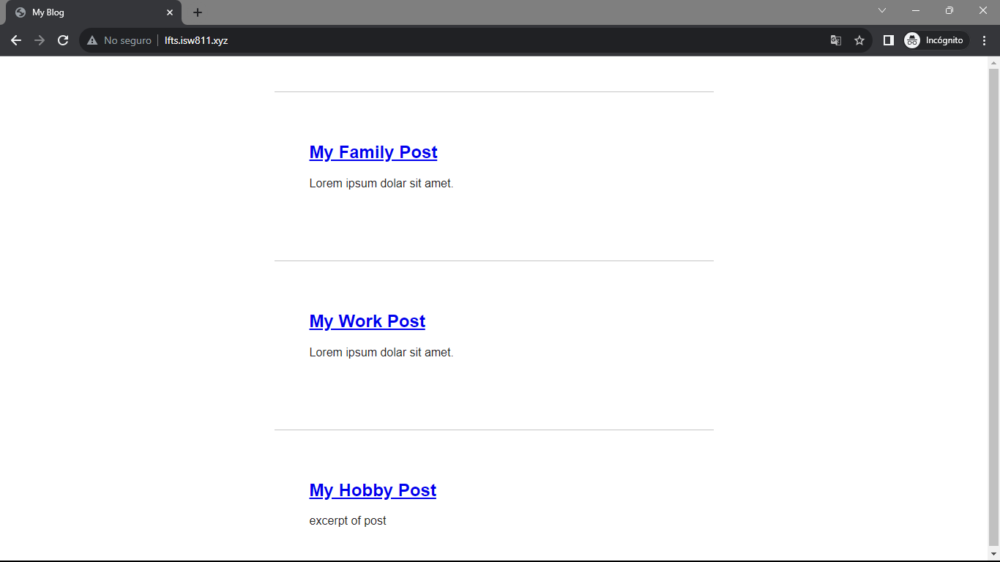
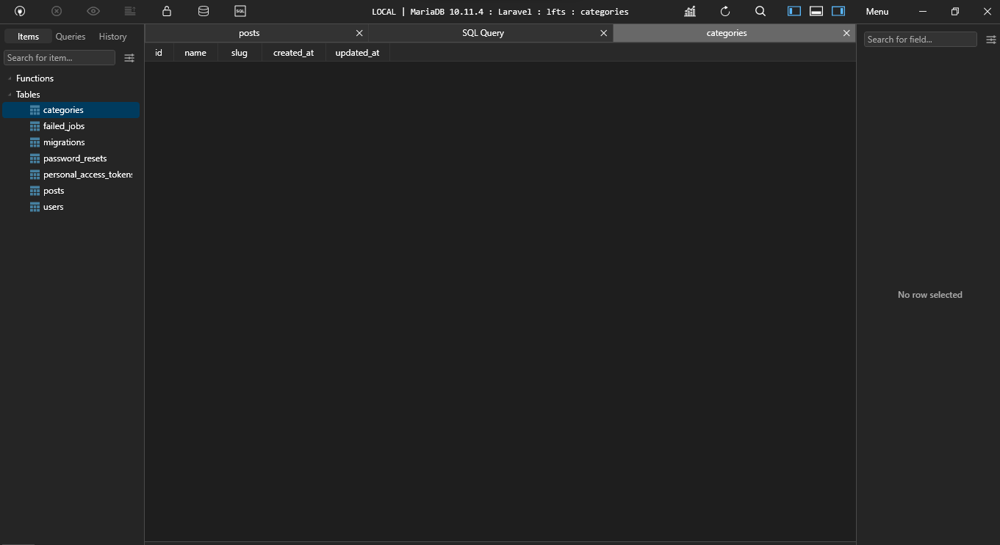
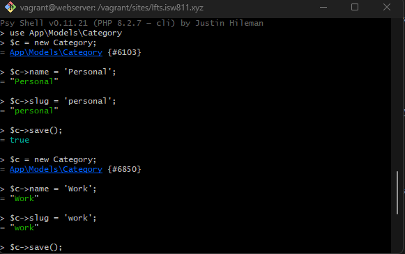
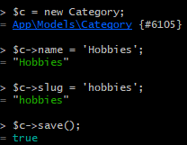
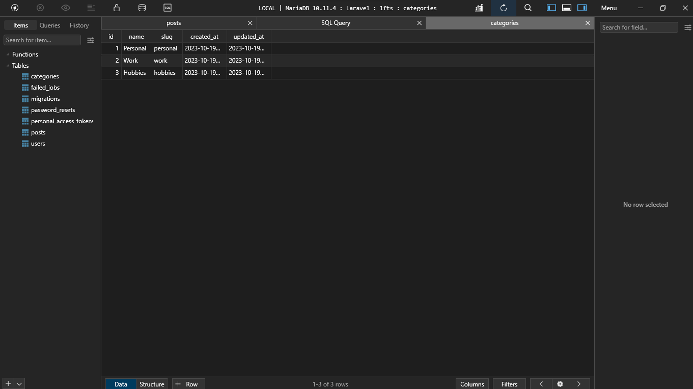
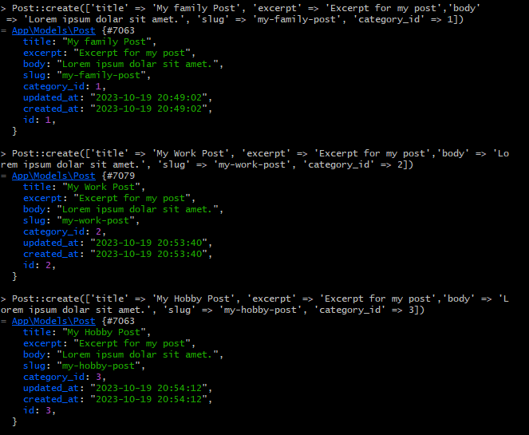
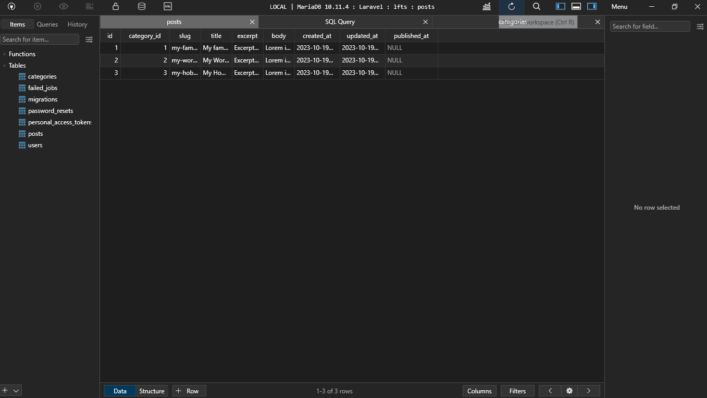

[< Volver a la pagina principal](/docs/readme.md)

# Your First Eloquent Relationship

En este episodio, nos corresponde averiguar cómo asignar una categoría a cada publicación. Para permitir esto, necesitaremos crear un nuevo modelo de Eloquent y migrarlo para representar una categoría.

Comenzaremos modificando los títulos de `My first post` , `My Second post` y `My Third post`, estos títulos los cambiaremos desde la base de datos para realizarlo más rápido.

Los títulos nuevos serían:  `My Family post` , `My Work post` y `My Hobby post`.

Asi se vería la pagina:



Ahora, abrimos nuestra maquina virtual y nos ubicamos en `/vagrant/sites/lfts.isw811.xyz` y ejecutamos el siguiente comando para crear una tabla llamada `categories` con su respectivo model.

```bash
php artisan make:model Category -m
```

Y después, de ejecutar el comando les debería de aparecer en el proyecto los siguientes archivos.

* Primero, en la carpeta `migrations` ubicada dentro de la carpeta `database`, se les debería a ver creado un nuevo archivo llamado `2023_10_19_201010_create_categories_table.php`.

* El segundo sería en la carpeta `Models`, se les debería de a ver creado un archivo llamado `Category.php`. 

Posteriormente, nos movemos al archivo `2023_10_19_201010_create_categories_table.php` para crear los atributos de esta tabla, los cuales son los siguiente:

```php
public function up()
    {
        Schema::create('categories', function (Blueprint $table) {
            $table->id();
            $table->string('name');
            $table->string('slug');
            $table->timestamps();
        });
    }
```

También, modificaremos el archivo `2023_10_18_110233_create_posts_table` para crear un atributo para llamar el id de la categoría.

```php  
$table->foreignId('category_id');
```

Ahora nos trasladamos de nuevo a la maquina virtual y ejecutamos el siguiente comando para borrar y volver a crear las tablas.

```bash
php artisan migrate:fresh
```

Verificamos que la base de datos se haya actualizado, la refrescamos y comprábamos las tablas, y sus nuevos atributos.




En seguida, en la maquina virtual ejecutamos el siguiente comando para empezar a crear categorías.

```bash
php artisan tinker
```

Y ahora si, creamos nuestras primeras categorías, las cuales se llaman: `Personal`, `Work` y `Hobbies`.






Revisamos la base de datos de que se haya creado las categorías:



Ahora crearemos los posts, primero ejecutamos el siguiente comando para posicionarnos el los post:

```bash
use App\Models\Post;
```

Ahora si, creamos nuestros posts:



Verificamos en la base de datos que todo este correctamente, que se hayan creado los post:



Listo, ahora nos ubicamos en el archivo `Post.php` para crear nuestra primera relación con eloquent con una función llamada `category`.

```php
class Post extends Model
{
    use HasFactory;

    protected $guarded = [];
    
    public function category()
    {
        return $this->belongsTo(Category::class);
    }
}
```

Para comprobar esta relación con eloquent, nos movemos a la maquina virtual y ejecutamos los siguientes comandos para que nos busque el post por categoría.

* Primero, buscamos nuestro primer post con el siguiente comando:

```bash
$post = App\Models\Post::first();
```

* Después, ejecutamos el siguiente comando para buscar la categoría correspondiente de ese post:

```bash
$post->category;
```

Y por ultimo podemos ver todo junto, el post con la categoría correspondiente mediante el siguiente comando:

```bash
$post
```

Y ya para finalizar para poder observar la categoría de cada post en la pagina, agregamos la siguiente linea de código a los archivos: `posts.blade.php` y `post.blade.php`.

```php
<p>
    <a href="#">{{$post->category->name}}</a>
</p>
```


